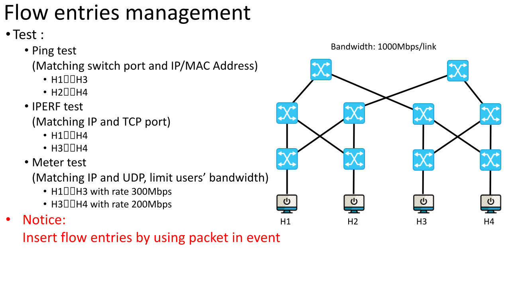
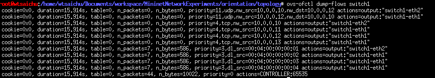

# Flow entries management

Tags: Mininet, ryu
Branch: Orientation
Date: 14. August 2023 → 20. August 2023
Introduction: Flow entry management (brute vorce)



### Table-miss flow entry

```python
# 設定 table-miss flow entry : 
match = ofp_parser.OFPMatch()   # 匹配所有封包
actions = [ofp_parser.OFPActionOutput(ofproto.OFPP_CONTROLLER, ofproto.OFPCML_NO_BUFFER)]   # 將整個封包發送到控制器
insturctions = [ofp_parser.OFPInstructionActions(ofproto.OFPIT_APPLY_ACTIONS, actions)] # 立即執行該動作
flow_add_modification_message = ofp_parser.OFPFlowMod(  # 添加 flow entry message ,屬於Controller-to-switch Messages
datapath = datapath,    # 交換機
match = match,  # 匹配項目
	cookie = 0, # Cookie 為 0
	command = ofproto.OFPFC_ADD,    # 0, /* New flow. */ 標示消息類型為 OFPFC_ADD
	idle_timeout = 0,   # 不限制匹配過期時間 （永久存在）
	hard_timeout = 0,   # 不限制硬性過期時間 （永久存在）
	priority = 0,   # 優先級為 0 （ table-miss 的必要條件）
	instructions = insturctions # 執行的動作
)
datapath.send_msg(flow_add_modification_message)    # 發送往交換機
self.logger.debug("Datapath {0} add table-miss flow entry with actions: send entire package to controller.".format(datapath.id))    # 顯示添加完成的 log
```

# Flow entry

| priority | name | match |  |  |  |  |  |  |  | datapath | actions |  |
| --- | --- | --- | --- | --- | --- | --- | --- | --- | --- | --- | --- | --- |
|  |  | eth_type | ip_proto | eth_src | eth_dst | ipv4_src | ipv4_dst | tcp_dst | in_port |  | output port | meter |
| 0 | table-miss | - |  |  |  |  |  |  |  | ALL | CONTROLLER | - |
| 1 | add_eth_src_branch_flow_entry | - | - | ✓ | - | - | - | - | - | 5,6,7,8 | 2 |  |
| 1 | - | - | - | - | - | - | - | - | ✓ | 9,10 | 1 |  |
| 2 | add_ipv4_src_branch_flow_entry | 0x0800 | 6 | - | - | ✓ | - | - | - | 5,6,7,8 | 2 |  |
| 3 | add_eth_src_flow_entry | - | - | ✓ | - | - | - | - | - | 1,2,3,4 | 1 |  |
| 4 | add_ipv4_src_flow_entry | 0x0800 | 6 | - | - | ✓ | - | - | - | 1,2,3,4 | 1 |  |
| 5 | add_eth_dst_flow_entry | - | - | - | ✓ | - | - | - | - | 5,6,7,8 | 1 |  |
| 6 | add_ipv4_dst_flow_entry | 0x0800 | 6 | - | - | - | ✓ | - | - | 5,6,7,8 | 1 |  |
| 7 | add_ipv4_dst_flow_entry | 0x0800 | 6 | - | - | - | ✓ | 5001 | - | 5,6,7,8 | 1 |  |
| 8 | add_eth_src_dst_flow_entry | - | - | ✓ | ✓ | - | - | - | - | 5,6,7,8 | 1 |  |
| 9 | add_ipv4_src_dst_flow_entry | 0x0800 | 6 | - | - | ✓ | ✓ | - | - | 5,6,7,8 | 1 |  |
| 10 | add_ipv4_src_dst_flow_entry | 0x0800 | 6 | - | - | ✓ | ✓ | 5001 | - | 5,6,7,8 | 1 |  |
| 11 | add_limited_rate_flow_entry | 0x0800 | 17 | - | - | ✓ | ✓ | - | - | * | 1 | ✓ |

由此可以得知：可以以下分成 3 個群組

1,2,3,4 ➡️ 下層 Lower Level

5,6,7,8 ➡️ 中層

9,10     ➡️ 上層，如圖

.png)

## Lower Level

### Origin

```python
if(datapath.id == 1):
	self.add_src_flow_entry(self.host_mac_address[0],2,datapath)    # 1 --> 5
	self.add_src_flow_entry(self.host_mac_address[1],1,datapath)    # 1 --> host1
	self.add_src_flow_entry(self.host_mac_address[2],1,datapath)    # 1 --> host1
	self.add_src_flow_entry(self.host_mac_address[3],1,datapath)    # 1 --> host1
            
if(datapath.id == 2):
	self.add_src_flow_entry(self.host_mac_address[0],1,datapath)    # 2 --> host2
	self.add_src_flow_entry(self.host_mac_address[1],2,datapath)    # 2 --> 5
	self.add_src_flow_entry(self.host_mac_address[2],1,datapath)    # 2 --> host2
	self.add_src_flow_entry(self.host_mac_address[3],1,datapath)    # 2 --> host2

if(datapath.id == 3):
	self.add_src_flow_entry(self.host_mac_address[0],1,datapath)    # 3 --> host3
	self.add_src_flow_entry(self.host_mac_address[1],1,datapath)    # 3 --> host3
	self.add_src_flow_entry(self.host_mac_address[2],2,datapath)    # 3 --> 7
	self.add_src_flow_entry(self.host_mac_address[3],1,datapath)    # 3 --> host3

if(datapath.id == 4):
	self.add_src_flow_entry(self.host_mac_address[0],1,datapath)    # 4 --> host4
	self.add_src_flow_entry(self.host_mac_address[1],1,datapath)    # 4 --> host4
	self.add_src_flow_entry(self.host_mac_address[2],1,datapath)    # 4 --> host4
	self.add_src_flow_entry(self.host_mac_address[3],2,datapath)    # 4 --> 7
```

### Code

```python
if(datapath.id < 5):    # 對於所有連接到主機的交換機 id < 5
	for index in range(len(self.host_mac_address)): # 遍歷所有主機的 mac address
	if(index == (datapath.id-1)):   # 如果是對應連接的主機
		self.add_eth_src_flow_entry(self.host_mac_address[index], 2, datapath)    # 將封包發送到 port 2 (匹配 eth_src = [self.host_mac_address[index]])
		self.add_ipv4_src_flow_entry(self.host_ip_address[index], 2, datapath)    # 將封包發送到 port 2 (匹配 ipv4_src = [self.host_ip_address[index]])
	else:   # 對於來源非連接主機
		self.add_eth_src_flow_entry(self.host_mac_address[index], 1, datapath)    # 發送到連接主機
		self.add_ipv4_src_flow_entry(self.host_ip_address[index], 1, datapath)    # 發送到連接主機
```

.png)

### Flow table

**switch1**



**switch2**


**switch3**


**switch4**


### 3 : add_eth_src_flow_entry

添加匹配項目為 eth_src = [mac_address] 且有指定唯一輸出 port 的 flow entry

| Parameter | Type | Introduction |
| --- | --- | --- |
| mac_address | string | source mac address |
| output_port | integer | forwarding port |
| datapath | Datapath | switch |

```python
# 添加匹配項目為 eth_src = [mac_address] 且有指定唯一輸出 port 的 flow entry
def add_eth_src_flow_entry(self,mac_address,output_port,datapath):  
	ofp_parser = datapath.ofproto_parser    # 創建和解析 OpenFlow message
	
	message = "Datapath {:2d} add flow entry with match : eth_src = {} ,actions : forwarding to port {}".format(datapath.id,mac_address,output_port)
	match = ofp_parser.OFPMatch(eth_src = mac_address)  # 以 eth_type =  ETH_TYPE_ARP, eth_src = [mac_address]為匹配項目
	actions = [ofp_parser.OFPActionOutput(port = output_port)]  # 輸出到指定 port
	self.add_flow_entry(match, actions, 3, datapath, message)   # 優先級為 3
```

### 4 : add_ipv4_src_flow_entry

添加匹配項目為 ipv4_src = [ipv4_address] 且有指定唯一輸出 port 的 flow entry

| Parameter | Type | Introduction |
| --- | --- | --- |
| ip_address | string | source ipv4 address |
| output_port | integer | forwarding port |
| datapath | Datapath | switch |

```python
# 添加匹配項目為 ipv4_src = [ipv4_address] 且有指定唯一輸出 port 的 flow entry
def add_ipv4_src_flow_entry(self,ip_address,output_port,datapath):
	ofp_parser = datapath.ofproto_parser    # 創建和解析 OpenFlow message

	message = "Datapath {:2d} add flow entry with match : eth_type=0x0800, ip_proto = 6, ipv4_src = {} ,actions : forwarding to port {}".format(datapath.id,ip_address,output_port)
	match = ofp_parser.OFPMatch(eth_type=0x0800, ip_proto = 6, ipv4_src = ip_address)    # 以 eth_type =  ETH_TYPE_IP, ip_proto = 6(TCP), ipv4_src = [ip_address]為匹配項目
	actions = [ofp_parser.OFPActionOutput(port = output_port)]  # 輸出到指定 port
	self.add_flow_entry(match, actions, 4, datapath, message)   # 優先級為 4
```

## Middle Level

### Origin 5-6

```python
if(datapath.id == 5):
	self.add_src_branch_flow_entry(self.host_mac_address[0],2,3,datapath)   # 5 --> 2   5 --> 9
	self.add_src_branch_flow_entry(self.host_mac_address[1],1,3,datapath)   # 5 --> 1   5 --> 9
	self.add_src_branch_flow_entry(self.host_mac_address[2],1,2,datapath)   # 5 --> 1   5 --> 2
	self.add_src_branch_flow_entry(self.host_mac_address[3],1,2,datapath)   # 5 --> 1   5 --> 2
	
	self.add_src_dst_flow_entry(self.host_mac_address[0],self.host_mac_address[1],2,datapath)   # 5 --> 2
	self.add_src_dst_flow_entry(self.host_mac_address[0],self.host_mac_address[2],3,datapath)   # 5 --> 9
	self.add_src_dst_flow_entry(self.host_mac_address[0],self.host_mac_address[3],3,datapath)   # 5 --> 9
	
	self.add_src_dst_flow_entry(self.host_mac_address[1],self.host_mac_address[0],1,datapath)   # 5 --> 1
	self.add_src_dst_flow_entry(self.host_mac_address[1],self.host_mac_address[2],3,datapath)   # 5 --> 9
	self.add_src_dst_flow_entry(self.host_mac_address[1],self.host_mac_address[3],3,datapath)   # 5 --> 9
	
	self.add_src_dst_flow_entry(self.host_mac_address[2],self.host_mac_address[0],1,datapath)   # 5 --> 1
	self.add_src_dst_flow_entry(self.host_mac_address[2],self.host_mac_address[1],2,datapath)   # 5 --> 2
	
	self.add_src_dst_flow_entry(self.host_mac_address[3],self.host_mac_address[0],1,datapath)   # 5 --> 1
	self.add_src_dst_flow_entry(self.host_mac_address[3],self.host_mac_address[1],2,datapath)   # 5 --> 2

if(datapath.id == 6):
	self.add_src_branch_flow_entry(self.host_mac_address[0],2,3,datapath)   # 6 --> 2   6 --> 10
	self.add_src_branch_flow_entry(self.host_mac_address[1],1,3,datapath)   # 6 --> 1   6 --> 10
	self.add_src_branch_flow_entry(self.host_mac_address[2],1,2,datapath)   # 6 --> 1   6 --> 2
	self.add_src_branch_flow_entry(self.host_mac_address[3],1,2,datapath)   # 6 --> 1   6 --> 2

	self.add_src_dst_flow_entry(self.host_mac_address[0],self.host_mac_address[1],2,datapath)   # 6 --> 2
	self.add_src_dst_flow_entry(self.host_mac_address[0],self.host_mac_address[2],3,datapath)   # 6 --> 10
	self.add_src_dst_flow_entry(self.host_mac_address[0],self.host_mac_address[3],3,datapath)   # 6 --> 10

	self.add_src_dst_flow_entry(self.host_mac_address[1],self.host_mac_address[0],1,datapath)   # 6 --> 1
	self.add_src_dst_flow_entry(self.host_mac_address[1],self.host_mac_address[2],3,datapath)   # 6 --> 10
	self.add_src_dst_flow_entry(self.host_mac_address[1],self.host_mac_address[3],3,datapath)   # 6 --> 10

	self.add_src_dst_flow_entry(self.host_mac_address[2],self.host_mac_address[0],1,datapath)   # 6 --> 1
	self.add_src_dst_flow_entry(self.host_mac_address[2],self.host_mac_address[1],2,datapath)   # 6 --> 2

	self.add_src_dst_flow_entry(self.host_mac_address[3],self.host_mac_address[0],1,datapath)   # 6 --> 1
	self.add_src_dst_flow_entry(self.host_mac_address[3],self.host_mac_address[1],2,datapath)   # 6 --> 2
```

### Code 5-6

```python
# 對於中層交換機
if(datapath.id > 4 and datapath.id < 7):
	branch =[   # 分支輸出 port
		[2,3],  # host1 : 5 --> 2/9  6 --> 2/10
		[1,3],  # host2 : 5 --> 1/9  6 --> 1/10
		[1,2],  # host1 : 5 --> 1/2  6 --> 1/2
		[1,2]   # host1 : 5 --> 1/2  6 --> 1/2
	]
            
	for index in range(len(self.host_mac_address)): # 依據 branch 和 address 添加 flow entry
		self.add_eth_src_branch_flow_entry(self.host_mac_address[index],branch[index][0],branch[index][1],datapath) # 添加具有分支輸出動作且匹配項目只有來源 mac_address 的 flow entry
		self.add_ipv4_src_branch_flow_entry(self.host_ip_address[index],branch[index][0],branch[index][1],datapath) # 添加具有分支輸出動作且匹配項目只有來源 ip_address 的 flow entry

	for dst in [2,3]:   # 對於 host3 和 host 4
		self.add_eth_dst_flow_entry(self.host_mac_address[dst],3,datapath)  # 添加 X --> host3/4 的 flow entry，match with mac_address
		self.add_ipv4_dst_flow_entry(self.host_ip_address[dst],3,datapath)  # 添加 X --> host3/4 的 flow entry，match with ipv4_address and tcp port

		self.add_eth_src_dst_flow_entry(self.host_mac_address[dst],self.host_mac_address[0],1,datapath) # 添加 host3/4 --> host1 的 flow entry，match with mac_address
		self.add_eth_src_dst_flow_entry(self.host_mac_address[dst],self.host_mac_address[1],2,datapath) # 添加 host3/4 --> host2 的 flow entry，match with mac_address

		self.add_ipv4_src_dst_flow_entry(self.host_ip_address[dst],self.host_ip_address[0],1,datapath)  # 添加 host3/4 --> host1 的 flow entry，match with ipv4_address and tcp port
		self.add_ipv4_src_dst_flow_entry(self.host_ip_address[dst],self.host_ip_address[1],2,datapath)  # 添加 host3/4 --> host2 的 flow entry，match with ipv4_address and tcp port

	self.add_eth_src_dst_flow_entry(self.host_mac_address[0],self.host_mac_address[1],2,datapath)   # 添加 host1 --> host2 的 match with mac_address
	self.add_eth_src_dst_flow_entry(self.host_mac_address[1],self.host_mac_address[0],1,datapath)   # 添加 host2 --> host1 的 match with mac_address

	self.add_ipv4_src_dst_flow_entry(self.host_ip_address[0],self.host_ip_address[1],2,datapath)    # 添加 host1 --> host2 的 flow entry，match with ipv4_address and tcp port
	self.add_ipv4_src_dst_flow_entry(self.host_ip_address[1],self.host_ip_address[0],1,datapath)    # 添加 host2 --> host1 的 flow entry，match with ipv4_address and tcp port
```

.png)

### Flow table 5-6

**switch5**


**switch6**


### Origin 7-8

```python
if(datapath.id == 7):
	self.add_src_branch_flow_entry(self.host_mac_address[0],1,2,datapath)   # 7 --> 3   7 --> 4
	self.add_src_branch_flow_entry(self.host_mac_address[1],1,2,datapath)   # 7 --> 3   7 --> 4
	self.add_src_branch_flow_entry(self.host_mac_address[2],2,3,datapath)   # 7 --> 4   7 --> 9
	self.add_src_branch_flow_entry(self.host_mac_address[3],1,3,datapath)   # 7 --> 3   7 --> 9

	self.add_src_dst_flow_entry(self.host_mac_address[0],self.host_mac_address[2],1,datapath)   # 7 --> 3
	self.add_src_dst_flow_entry(self.host_mac_address[0],self.host_mac_address[3],2,datapath)   # 7 --> 4
	
	self.add_src_dst_flow_entry(self.host_mac_address[1],self.host_mac_address[2],1,datapath)   # 7 --> 3
	self.add_src_dst_flow_entry(self.host_mac_address[1],self.host_mac_address[3],2,datapath)   # 7 --> 4
	
	self.add_src_dst_flow_entry(self.host_mac_address[2],self.host_mac_address[0],3,datapath)   # 7 --> 9
	self.add_src_dst_flow_entry(self.host_mac_address[2],self.host_mac_address[1],3,datapath)   # 7 --> 9
	self.add_src_dst_flow_entry(self.host_mac_address[2],self.host_mac_address[3],2,datapath)   # 7 --> 4
	
	self.add_src_dst_flow_entry(self.host_mac_address[3],self.host_mac_address[0],3,datapath)   # 7 --> 9
	self.add_src_dst_flow_entry(self.host_mac_address[3],self.host_mac_address[1],3,datapath)   # 7 --> 9
	self.add_src_dst_flow_entry(self.host_mac_address[3],self.host_mac_address[2],1,datapath)   # 7 --> 3

if(datapath.id == 8):
	self.add_src_branch_flow_entry(self.host_mac_address[0],1,2,datapath)   # 8 --> 3   8 --> 4
	self.add_src_branch_flow_entry(self.host_mac_address[1],1,2,datapath)   # 8 --> 3   8 --> 4
	self.add_src_branch_flow_entry(self.host_mac_address[2],2,3,datapath)   # 8 --> 4   8 --> 10
	self.add_src_branch_flow_entry(self.host_mac_address[3],1,3,datapath)   # 8 --> 3   8 --> 10
	
	self.add_src_dst_flow_entry(self.host_mac_address[0],self.host_mac_address[2],1,datapath)   # 8 --> 3
	self.add_src_dst_flow_entry(self.host_mac_address[0],self.host_mac_address[3],2,datapath)   # 8 --> 4
	
	self.add_src_dst_flow_entry(self.host_mac_address[1],self.host_mac_address[2],1,datapath)   # 8 --> 3
	self.add_src_dst_flow_entry(self.host_mac_address[1],self.host_mac_address[3],2,datapath)   # 8 --> 4
	
	self.add_src_dst_flow_entry(self.host_mac_address[2],self.host_mac_address[0],3,datapath)   # 8 --> 10
	self.add_src_dst_flow_entry(self.host_mac_address[2],self.host_mac_address[1],3,datapath)   # 8 --> 10
	self.add_src_dst_flow_entry(self.host_mac_address[2],self.host_mac_address[3],2,datapath)   # 8 --> 4
	
	self.add_src_dst_flow_entry(self.host_mac_address[3],self.host_mac_address[0],3,datapath)   # 8 --> 10
	self.add_src_dst_flow_entry(self.host_mac_address[3],self.host_mac_address[1],3,datapath)   # 8 --> 10
	self.add_src_dst_flow_entry(self.host_mac_address[3],self.host_mac_address[2],1,datapath)   # 8 --> 3
```

### Code 7-8

```python
# 對於中層交換機
if(datapath.id > 6 and datapath.id < 9):
	branch =[   # 分支輸出 port
		[1,2],  # host1 : 7 --> 3/4  8 --> 3/4 
		[1,2],  # host1 : 7 --> 3/4  6 --> 3/4
		[2,3],  # host1 : 7 --> 4/9  6 --> 4/10
		[1,3]   # host1 : 7 --> 3/9  6 --> 3/10
	]
	for index in range(len(self.host_mac_address)): # 依據 branch 和 address 添加 flow entry
		self.add_eth_src_branch_flow_entry(self.host_mac_address[index],branch[index][0],branch[index][1],datapath)     # 添加具有分支輸出動作且匹配項目只有來源 mac_address 的 flow entry
		self.add_ipv4_src_branch_flow_entry(self.host_ip_address[index],branch[index][0],branch[index][1],datapath)     # 添加具有分支輸出動作且匹配項目只有來源 ip_address 的 flow entry
	
	for dst in [0,1]:   # 對於 host1 和 host2
		self.add_eth_dst_flow_entry(self.host_mac_address[dst],3,datapath)  # 添加 X --> host1/2 的 flow entry，match with mac_address
		self.add_ipv4_dst_flow_entry(self.host_ip_address[dst],3,datapath)  # 添加 X --> host1/2 的 flow entry，match with ipv4_address and tcp port
		
		self.add_eth_src_dst_flow_entry(self.host_mac_address[dst],self.host_mac_address[2],1,datapath) # 添加 host1/2 --> host3 的 flow entry，match with mac_address
		self.add_eth_src_dst_flow_entry(self.host_mac_address[dst],self.host_mac_address[3],2,datapath) # 添加 host1/2 --> host4 的 flow entry，match with mac_address
		
		self.add_ipv4_src_dst_flow_entry(self.host_ip_address[dst],self.host_ip_address[2],1,datapath)  # 添加 host1/2 --> host3 的 flow entry，match with ipv4_address and tcp port
		self.add_ipv4_src_dst_flow_entry(self.host_ip_address[dst],self.host_ip_address[3],2,datapath)  # 添加 host1/2 --> host4 的 flow entry，match with ipv4_address and tcp port    
	
	self.add_eth_src_dst_flow_entry(self.host_mac_address[2],self.host_mac_address[3],2,datapath)   # 添加 host3 --> host4 的 match with mac_address
	self.add_eth_src_dst_flow_entry(self.host_mac_address[3],self.host_mac_address[2],1,datapath)   # 添加 host4 --> host3 的 match with mac_address
	
	self.add_ipv4_src_dst_flow_entry(self.host_ip_address[2],self.host_ip_address[3],2,datapath)    # 添加 host3 --> host4 的 flow entry，match with ipv4_address and tcp port
	self.add_ipv4_src_dst_flow_entry(self.host_ip_address[3],self.host_ip_address[2],1,datapath)    # 添加 host4 --> host3 的 flow entry，match with ipv4_address and tcp port
```

.png)

### Flow table 7-8

**switch7**


**switch8**


### 1 : add_eth_src_branch_flow_entry

添加匹配項目為 eth_src = [mac_address] 的 且有指定兩個輸出 port flow entry

| Parameter | Type | Introduction |
| --- | --- | --- |
| mac_address | string | source mac address |
| output_port_ein | integer | forwarding port one |
| output_port_zwei | integer | forwarding port two |
| datapath | Datapath | switch |

```python
# 添加匹配項目為 eth_src = [mac_address] 的 且有指定兩個輸出 port flow entry
def add_eth_src_branch_flow_entry(self,mac_address,output_port_ein,output_port_zwei,datapath):
	ofp_parser = datapath.ofproto_parser    # 創建和解析 OpenFlow message

	message = "Datapath {:2d} add flow entry with match : eth_src = {} ,actions : forwarding to port1 {} , port2 {}".format(datapath.id,mac_address,output_port_ein,output_port_zwei)
	match = ofp_parser.OFPMatch(eth_src = mac_address)  # 以 eth_type =  ETH_TYPE_ARP, eth_src = [mac_address]為匹配項目
	actions = [ofp_parser.OFPActionOutput(port = output_port_ein),  # 輸出到兩個指定 port
		ofp_parser.OFPActionOutput(port = output_port_zwei)]
	self.add_flow_entry(match, actions, 1, datapath, message)   # 優先級為 1
```

### 2 : add_ipv4_src_branch_flow_entry

添加匹配項目為 ipv4_src = [ipv4_address] 的 且有指定兩個輸出 port flow entry

| Parameter | Type | Introduction |
| --- | --- | --- |
| mac_address | string | source ipv4 address |
| output_port_ein | integer | forwarding port one |
| output_port_zwei | integer | forwarding port two |
| datapath | Datapath | switch |

```python
# 添加匹配項目為 ipv4_src = [ipv4_address] 的 且有指定兩個輸出 port flow entry
def add_ipv4_src_branch_flow_entry(self, ip_address, output_port_ein, output_port_zwei, datapath):
	ofp_parser = datapath.ofproto_parser    # 創建和解析 OpenFlow message
	
	message = "Datapath {:2d} add flow entry with match : eth_type=0x0800, ip_proto = 6, ipv4_src = {} , actions : forwarding to port1 {} , port2 {}".format(datapath.id, ip_address, output_port_ein, output_port_zwei)
	match = ofp_parser.OFPMatch(eth_type=0x0800, ip_proto = 6, ipv4_src = ip_address)   # 以 eth_type =  ETH_TYPE_IP, ip_proto = 6(TCP), ipv4_src = [ip_address]為匹配項目
	actions = [ofp_parser.OFPActionOutput(port = output_port_ein),  # 輸出到兩個指定 port
		ofp_parser.OFPActionOutput(port = output_port_zwei)]
	self.add_flow_entry(match, actions, 2, datapath, message)   # 優先級為 2
```

### 5 : add_eth_dst_flow_entry

添加匹配項目為 eth_dst = [mac_address] 且有指定唯一輸出 port 的 flow entry

| Parameter | Type | Introduction |
| --- | --- | --- |
| dst_mac_address | string | destination mac address |
| output_port | integer | forwarding port |
| datapath | Datapath | switch |

```python
#添加匹配項目為 eth_dst = [mac_address] 且有指定唯一輸出 port 的 flow entry
def add_eth_dst_flow_entry(self, dst_mac_address, output_port, datapath):
	ofp_parser = datapath.ofproto_parser    # 創建和解析 OpenFlow message
	
	message = "Datapath {:2d} add flow entry with match : eth_dst = {} , actions : forwarding to port {}".format(datapath.id, dst_mac_address, output_port)
	match = ofp_parser.OFPMatch(eth_dst = dst_mac_address)  # 以 eth_type =  ETH_TYPE_ARP, eth_src = [src_mac_address] , eth_dst =[dst_mac_address] 為匹配項目
	actions = [ofp_parser.OFPActionOutput(port = output_port)]  # 輸出到指定 port
	self.add_flow_entry(match, actions, 5, datapath, message)   # 優先級為 5
```

### 6/7 : add_ipv4_dst_flow_entry

添加匹配項目為 ipv4_dst = [ip_address] 且有指定唯一輸出 port 的 flow entry

| Parameter | Type | Introduction |
| --- | --- | --- |
| dst_ip_address | string | destination ipv4 address |
| output_port | integer | forwarding port |
| datapath | Datapath | switch |

```python
# 添加匹配項目為 ipv4_dst = [ip_address] 且有指定唯一輸出 port 的 flow entry
def add_ipv4_dst_flow_entry(self, dst_ip_address, output_port, datapath):
	ofp_parser = datapath.ofproto_parser    # 創建和解析 OpenFlow message

	message = "Datapath {:2d} add flow entry with match :eth_type=0x0800, ip_proto = 6 , ipv4_dst = {} , actions : forwarding to port {}".format(datapath.id, dst_ip_address, output_port)
	match = ofp_parser.OFPMatch(eth_type=0x0800, ip_proto = 6 , ipv4_dst = dst_ip_address)   # 以 eth_type =  ETH_TYPE_IP, ip_proto = 6(TCP), ipv4_dst = [dst_ip_address] 為匹配項目
	actions = [ofp_parser.OFPActionOutput(port = output_port)]  # 輸出到指定 port
	self.add_flow_entry(match, actions, 6, datapath, message)   # 優先級為 6
	
	message = "Datapath {:2d} add flow entry with match : eth_type=0x0800, ip_proto = 6 , ipv4_dst = {} tcp_dst = 5001 , actions : forwarding to port {}".format(datapath.id, dst_ip_address, output_port)
	match = ofp_parser.OFPMatch(eth_type=0x0800, ip_proto = 6 , ipv4_dst = dst_ip_address, tcp_dst = 5001)  # 以 eth_type =  ETH_TYPE_IP, ip_proto = 6(TCP), ipv4_dst = [dst_ip_address], tcp_port = 5001 為匹配項目
	actions = [ofp_parser.OFPActionOutput(port = output_port)]  # 輸出到指定 port
	self.add_flow_entry(match, actions, 7, datapath, message)   # 優先級為 7
```

### 8 : add_eth_src_dst_flow_entry

添加匹配項目為 eth_src = [src_mac_address] eth_dst = [dst_mac_address] 且有指定唯一輸出 port 的 flow entry

| Parameter | Type | Introduction |
| --- | --- | --- |
| src_mac_address | string | source mac address |
| dst_mac_address | string | destination mac address |
| output_port | integer | forwarding port |
| datapath | Datapath | switch |

```python
# 添加匹配項目為 eth_src = [src_mac_address] eth_dst = [dst_mac_address] 且有指定唯一輸出 port 的 flow entry
def add_eth_src_dst_flow_entry(self, src_mac_address, dst_mac_address, output_port, datapath):
	ofp_parser = datapath.ofproto_parser    # 創建和解析 OpenFlow message

	message = "Datapath {:2d} add flow entry with match : eth_src = {} , eth_dst = {} , actions : forwarding to port {}".format(datapath.id, src_mac_address, dst_mac_address, output_port)
	match = ofp_parser.OFPMatch(eth_src = src_mac_address, eth_dst = dst_mac_address)    # 以 eth_type =  ETH_TYPE_ARP, eth_src = [src_mac_address] , eth_dst =[dst_mac_address] 為匹配項目
  actions = [ofp_parser.OFPActionOutput(port = output_port)]  # 輸出到指定 port
  self.add_flow_entry(match, actions, 8, datapath, message)   # 優先級為 8
```

### 9/10 : add_ipv4_src_dst_flow_entry

添加匹配項目為 ipv4_src = [src_ip_address] ipv4_dst = [dst_ip_address] 且有指定唯一輸出 port 的 flow entry

| Parameter | Type | Introduction |
| --- | --- | --- |
| src_ip_address | string | source ipv4 address |
| dst_ip_address | string | destination ipv4 address |
| output_port | integer | forwarding port |
| datapath | Datapath | switch |

```python
# 添加匹配項目為 ipv4_src = [src_ip_address] ipv4_dst = [dst_ip_address] 且有指定唯一輸出 port 的 flow entry
def add_ipv4_src_dst_flow_entry(self, src_ip_address, dst_ip_address, output_port, datapath):
	ofp_parser = datapath.ofproto_parser    # 創建和解析 OpenFlow message
	
	message = "Datapath {:2d} add flow entry with match : eth_type=0x0800, ip_proto = 6, ipv4_src = {} , ipv4_dst = {} , actions : forwarding to port {}".format(datapath.id, src_ip_address, dst_ip_address, output_port)
	match = ofp_parser.OFPMatch(eth_type=0x0800, ip_proto = 6 , ipv4_src = src_ip_address, ipv4_dst = dst_ip_address)     # 以 eth_type =  ETH_TYPE_IP, ip_proto = 6(TCP), ipv4_src = [ip_address], ipv4_dst = [dst_ip_address] 為匹配項目
	actions = [ofp_parser.OFPActionOutput(port = output_port)]  # 輸出到指定 port
	self.add_flow_entry(match, actions, 9, datapath, message)   # 優先級為 9
	
	# 添加指定 tcp_port = 5001 的 flow entry
	message = "Datapath {:2d} add flow entry with match : eth_type=0x0800, ip_proto = 6, ipv4_src = {} , ipv4_dst = {} tcp_dst = 5001 , actions : forwarding to port {}".format(datapath.id, src_ip_address, dst_ip_address, output_port)
	match = ofp_parser.OFPMatch(eth_type=0x0800, ip_proto = 6 , ipv4_src = src_ip_address, ipv4_dst = dst_ip_address, tcp_dst = 5001)   # 以 eth_type =  ETH_TYPE_IP, ip_proto = 6(TCP), ipv4_src = [ip_address], ipv4_dst = [dst_ip_address], tcp_port = 5001 為匹配項目
	actions = [ofp_parser.OFPActionOutput(port = output_port)]  # 輸出到指定 port
	self.add_flow_entry(match, actions, 10, datapath, message)   # 優先級為 10
```

## Upper Layer

### Code

```python
# 對於頂層的交換機
if(datapath.id > 8):
	message = "Datapath {:2d} add flow entry with match : in_port = {} , actions : forwarding to port {}".format(datapath.id, 1, 2)
	match = ofp_parser.OFPMatch(in_port = 1)
	actions = [ofp_parser.OFPActionOutput(port = 2)]
	self.add_flow_entry(match, actions, 1, datapath, message)   # 9 --> 7 / 10 --> 8

	message = "Datapath {:2d} add flow entry with match : in_port = {} , actions : forwarding to port {}".format(datapath.id, 2, 1)
	match = ofp_parser.OFPMatch(in_port = 2)
	actions = [ofp_parser.OFPActionOutput(port = 1)]    # 9 --> 5 / 10 --> 6
	self.add_flow_entry(match, actions, 1, datapath, message)
```

.png)

### Flow table

**switch9**


**switch10**


### add_flow_entry

發送一個 flow mod 去添加一個 flow entry

| Parameter | Type | Introduction |
| --- | --- | --- |
| match | Match | match field |
| actions | list | actions field |
| priority | integer | priority field |
| datapath | Datapath |  switch |
| message | string | message log in ryu.log |

```python
# 發送一個 flow mod 去添加一個 flow entry
def add_flow_entry(self,match,actions,priority,datapath,message):
	ofproto = datapath.ofproto  #  OpenFlow 協議相關訊息
	ofp_parser = datapath.ofproto_parser    # 創建和解析 OpenFlow message
	
	insturctions = [ofp_parser.OFPInstructionActions(ofproto.OFPIT_APPLY_ACTIONS, actions)] # 立即執行該動作
	flow_add_modification_message = ofp_parser.OFPFlowMod(  # 添加 flow entry message ,屬於Controller-to-switch Messages
		datapath = datapath,    # 交換機
		match = match,  # 匹配項目
		cookie = 0, # Cookie 為 0
		command = ofproto.OFPFC_ADD,    # 0, /* New flow. */ 標示消息類型為 OFPFC_ADD
		idle_timeout = 0,   # 不限制匹配過期時間 （永久存在）
		hard_timeout = 0,   # 不限制硬性過期時間 （永久存在）
		priority = priority,   
		instructions = insturctions # 執行的動作
	)
	datapath.send_msg(flow_add_modification_message)    # 發送往交換機
	self.logger.info(message)    # 顯示添加完成的 log
```

# **Ping test**

Matching switch port and IP/MAC Address

- H1🡨🡪H3
- H2🡨🡪H4

## Command

### Terminal 1

```
cd /home/wtsaichu/Documents/workspace/MininetNetworkExperiments/orientation/controller/D-Flow_entries_management
ryu-manager controller.py --log-file flow_entries_management.log
```

### Terminal 2

```
cd /home/wtsaichu/Documents/workspace/MininetNetworkExperiments/orientation/topology
sudo python3 topology.py
```

## pingall


## H1🡨🡪H3

```
host1 ping host3 -c 10
host3 ping host1 -c 10
```


## H2🡨🡪H4

```
host2 ping host4 -c 10
host4 ping host2 -c 10
```


# **IPERF test**

Matching IP and TCP port

- H1🡨🡪H4
- H3🡨🡪H4

## Command

```
xterm host1 host3 host4
```

## H1🡨🡪H4

### host1

```
iperf -s -p 5001
```


### host4

```
iperf -c 10.0.0.10 -p 5001
```


## H3🡨🡪H4

### host3

```
iperf -s -p 5001
```


### host4

```
iperf -c 10.0.0.12 -p 5001
```


# **Meter test**

(Matching IP and UDP, limit users’ bandwidth)

- H1🡨🡪H3 with rate 300Mbps
- H3🡨🡪H4 with rate 200Mbps

## Command

```
xterm host1 host3 host4
```

## H1🡨🡪H3 with rate 300Mbps

### host1

```
iperf -s- u -p 5001
```


### host3

```
iperf -c 10.0.0.10 -u -b 500M
```


## H3🡨🡪H4 with rate 200Mbps

### host3

```
iperf -s- u -p 5001
```


### host4

```
iperf -c 10.0.0.12 -u -b 500M
```

