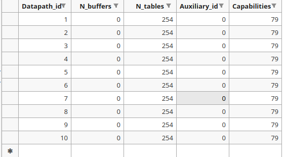

# Statistics of networks

Tags: Mininet, ryu
Branch: Orientation
Date: 16. August 2023 → 22. August 2023

.png)

### Table-miss flow entry

```python
# 設定 table-miss flow entry : 
match = ofp_parser.OFPMatch()   # 匹配所有封包
actions = [ofp_parser.OFPActionOutput(ofproto.OFPP_CONTROLLER, ofproto.OFPCML_NO_BUFFER)]   # 將整個封包發送到控制器
insturctions = [ofp_parser.OFPInstructionActions(ofproto.OFPIT_APPLY_ACTIONS, actions)] # 立即執行該動作
flow_add_modification_message = ofp_parser.OFPFlowMod(  # 添加 flow entry message ,屬於Controller-to-switch Messages
datapath = datapath,    # 交換機
match = match,  # 匹配項目
	cookie = 0, # Cookie 為 0
	command = ofproto.OFPFC_ADD,    # 0, /* New flow. */ 標示消息類型為 OFPFC_ADD
	idle_timeout = 0,   # 不限制匹配過期時間 （永久存在）
	hard_timeout = 0,   # 不限制硬性過期時間 （永久存在）
	priority = 0,   # 優先級為 0 （ table-miss 的必要條件）
	instructions = insturctions # 執行的動作
)
datapath.send_msg(flow_add_modification_message)    # 發送往交換機
self.logger.debug("Datapath {0} add table-miss flow entry with actions: send entire package to controller.".format(datapath.id))    # 顯示添加完成的 log
```

# Flow entry

| priority | name | match |  |  |  |  |  |  |  | datapath | actions |  |
| --- | --- | --- | --- | --- | --- | --- | --- | --- | --- | --- | --- | --- |
|  |  | eth_type | ip_proto | eth_src | eth_dst | ipv4_src | ipv4_dst | tcp_dst | in_port |  | output port | meter |
| 0 | table-miss | - |  |  |  |  |  |  |  | ALL | CONTROLLER | - |
| 1 | add_eth_src_branch_flow_entry | - | - | ✓ | - | - | - | - | - | 5,6,7,8 | 2 |  |
| 1 | - | - | - | - | - | - | - | - | ✓ | 9,10 | 1 |  |
| 2 | add_ipv4_src_branch_flow_entry | 0x0800 | 6 | - | - | ✓ | - | - | - | 5,6,7,8 | 2 |  |
| 3 | add_eth_src_flow_entry | - | - | ✓ | - | - | - | - | - | 1,2,3,4 | 1 |  |
| 4 | add_ipv4_src_flow_entry | 0x0800 | 6 | - | - | ✓ | - | - | - | 1,2,3,4 | 1 |  |
| 5 | add_eth_dst_flow_entry | - | - | - | ✓ | - | - | - | - | 5,6,7,8 | 1 |  |
| 6 | add_ipv4_dst_flow_entry | 0x0800 | 6 | - | - | - | ✓ | - | - | 5,6,7,8 | 1 |  |
| 7 | add_ipv4_dst_flow_entry | 0x0800 | 6 | - | - | - | ✓ | 5001 | - | 5,6,7,8 | 1 |  |
| 8 | add_eth_src_dst_flow_entry | - | - | ✓ | ✓ | - | - | - | - | 5,6,7,8 | 1 |  |
| 9 | add_ipv4_src_dst_flow_entry | 0x0800 | 6 | - | - | ✓ | ✓ | - | - | 5,6,7,8 | 1 |  |
| 10 | add_ipv4_src_dst_flow_entry | 0x0800 | 6 | - | - | ✓ | ✓ | 5001 | - | 5,6,7,8 | 1 |  |
| 11 | add_limited_rate_flow_entry | 0x0800 | 17 | - | - | ✓ | ✓ | - | - | * | 1 | ✓ |

由此可以得知：可以以下分成 3 個群組

1,2,3,4 ➡️ 下層 Lower Level

5,6,7,8 ➡️ 中層

9,10     ➡️ 上層，如圖

.png)

# UDP Traffic (Using IPERF)

## Add meter entry

**In EventOFPSwitchFeatures**

```python
self.add_meter_entry(1,100,datapath)    # 限制流量速率為 100, meter_ID 為 1
self.add_meter_entry(2,200,datapath)    # 限制流量速率為 200, meter_ID 為 2
self.add_meter_entry(3,300,datapath)    # 限制流量速率為 300, meter_ID 為 3
self.add_meter_entry(4,400,datapath)    # 限制流量速率為 400, meter_ID 為 4
```

**In function**

```python
# Add a meter entry
def add_meter_entry(self, meter_identifier, rate, datapath):
    ofproto = datapath.ofproto  # OpenFlow protocol-related information
    ofp_parser = datapath.ofproto_parser  # Create and parse OpenFlow messages

    bandwidth = [ofp_parser.OFPMeterBandDrop(rate * 1000, 10)]  # Bandwidth: Drop the first 10 packets exceeding rate Mbps
    meter_add_modification_message = ofp_parser.OFPMeterMod(
        datapath=datapath,  # Datapath object
        command=ofproto.OFPMC_ADD,  # Add a new meter entry
        flags=ofproto.OFPMF_KBPS,  # Rate unit is KBPS
        meter_id=meter_identifier,  # Specify meter ID
        bands=bandwidth  # Bandwidth settings
    )
    datapath.send_msg(meter_add_modification_message)  # Send meter mod message to switch
    self.logger.info("Add meter entry with identifier {:2d} and bandwidth: {:4d} Mbps.".format(meter_identifier, rate))

# Add a flow entry with a meter entry
def add_limited_rate_flow_entry(self, src_ip_address, dst_ip_address, output_port, meter_identifier, datapath):
    ofp_parser = datapath.ofproto_parser  # Create and parse OpenFlow messages
    ofproto = datapath.ofproto  # OpenFlow protocol-related information

    message = "Datapath {:2d} add flow entry with match: eth_type=0x0800, ip_proto=17, ipv4_src={}, ipv4_dst={}, actions: forwarding to port {} with meter entry: ID = {:2d}, bandwidth = {:4d} Mbps".format(datapath.id, src_ip_address, dst_ip_address, output_port, meter_identifier, (meter_identifier * 100))
    match = ofp_parser.OFPMatch(eth_type=0x0800, ip_proto=17, ipv4_src=src_ip_address, ipv4_dst=dst_ip_address)  # Match criteria
    actions = [ofp_parser.OFPActionOutput(port=output_port)]  # Output to the specified port
    instructions = [
        ofp_parser.OFPInstructionActions(ofproto.OFPIT_APPLY_ACTIONS, actions),  # Immediately output to the specified port
        ofp_parser.OFPInstructionMeter(meter_identifier, ofproto.OFPIT_METER)  # Add the specified meter entry
    ]

    flow_add_modification_message = ofp_parser.OFPFlowMod(
        datapath=datapath,  # Datapath
        match=match,  # Match criteria
        cookie=0,  # Cookie is 0
        command=ofproto.OFPFC_ADD,  # Message type is OFPFC_ADD
        idle_timeout=0,  # No idle timeout (permanent)
        hard_timeout=0,  # No hard timeout (permanent)
        priority=11,  # Priority is 11 (highest)
        instructions=instructions  # Actions to execute
    )
    datapath.send_msg(flow_add_modification_message)  # Send to switch
    self.logger.info(message)  # Display completion log
```

## H1🡨🡪H3 with rate 200Mbps

```python
# H1 -> H3 with rate 200Mbps
if datapath.id == 1:
    self.add_limited_rate_flow_entry(self.host_ip_address[0], self.host_ip_address[2], 2, 2, datapath)
    self.add_limited_rate_flow_entry(self.host_ip_address[2], self.host_ip_address[0], 1, 2, datapath)

if datapath.id == 5:
    self.add_limited_rate_flow_entry(self.host_ip_address[0], self.host_ip_address[2], 3, 2, datapath)
    self.add_limited_rate_flow_entry(self.host_ip_address[2], self.host_ip_address[0], 1, 2, datapath)

if datapath.id == 9:
    self.add_limited_rate_flow_entry(self.host_ip_address[0], self.host_ip_address[2], 2, 2, datapath)
    self.add_limited_rate_flow_entry(self.host_ip_address[2], self.host_ip_address[0], 1, 2, datapath)

if datapath.id == 7:
    self.add_limited_rate_flow_entry(self.host_ip_address[0], self.host_ip_address[2], 1, 2, datapath)
    self.add_limited_rate_flow_entry(self.host_ip_address[2], self.host_ip_address[0], 3, 2, datapath)

if datapath.id == 3:
    self.add_limited_rate_flow_entry(self.host_ip_address[0], self.host_ip_address[2], 1, 2, datapath)
    self.add_limited_rate_flow_entry(self.host_ip_address[2], self.host_ip_address[0], 2, 2, datapath)
```

.png)

## **H2 🡨🡪 H3 with rate 100Mbps**

```python
# H2 -> H3 with rate 100Mbps
if datapath.id == 2:
    self.add_limited_rate_flow_entry(self.host_ip_address[1], self.host_ip_address[2], 3, 1, datapath)
    self.add_limited_rate_flow_entry(self.host_ip_address[2], self.host_ip_address[1], 1, 1, datapath)

if datapath.id == 6:
    self.add_limited_rate_flow_entry(self.host_ip_address[1], self.host_ip_address[2], 3, 1, datapath)
    self.add_limited_rate_flow_entry(self.host_ip_address[2], self.host_ip_address[1], 2, 1, datapath)

if datapath.id == 10:
    self.add_limited_rate_flow_entry(self.host_ip_address[1], self.host_ip_address[2], 2, 1, datapath)
    self.add_limited_rate_flow_entry(self.host_ip_address[2], self.host_ip_address[1], 1, 1, datapath)

if datapath.id == 8:
    self.add_limited_rate_flow_entry(self.host_ip_address[1], self.host_ip_address[2], 1, 1, datapath)
    self.add_limited_rate_flow_entry(self.host_ip_address[2], self.host_ip_address[1], 3, 1, datapath)

if datapath.id == 3:
    self.add_limited_rate_flow_entry(self.host_ip_address[1], self.host_ip_address[2], 1, 1, datapath)
    self.add_limited_rate_flow_entry(self.host_ip_address[2], self.host_ip_address[1], 3, 1, datapath)
```

.png)

## H1🡨🡪H4 with rate 300Mbps

```python
# self.add_meter_entry(3, 250, datapath)
# H1 -> H4 with rate 300Mbps
if datapath.id == 1:
    self.add_limited_rate_flow_entry(self.host_ip_address[0], self.host_ip_address[3], 2, 3, datapath)
    self.add_limited_rate_flow_entry(self.host_ip_address[3], self.host_ip_address[0], 1, 3, datapath)

if datapath.id == 5:
    self.add_limited_rate_flow_entry(self.host_ip_address[0], self.host_ip_address[3], 3, 3, datapath)
    self.add_limited_rate_flow_entry(self.host_ip_address[3], self.host_ip_address[0], 1, 3, datapath)

if datapath.id == 9:
    self.add_limited_rate_flow_entry(self.host_ip_address[0], self.host_ip_address[3], 2, 3, datapath)
    self.add_limited_rate_flow_entry(self.host_ip_address[3], self.host_ip_address[0], 1, 3, datapath)

if datapath.id == 7:
    self.add_limited_rate_flow_entry(self.host_ip_address[0], self.host_ip_address[3], 2, 3, datapath)
    self.add_limited_rate_flow_entry(self.host_ip_address[3], self.host_ip_address[0], 3, 3, datapath)

if datapath.id == 4:
    self.add_limited_rate_flow_entry(self.host_ip_address[0], self.host_ip_address[3], 1, 3, datapath)
    self.add_limited_rate_flow_entry(self.host_ip_address[3], self.host_ip_address[0], 2, 3, datapath)
```

.png)

## H2🡨🡪H4 with rate 400Mbps

```python
# self.add_meter_entry(4,350,datapath)
# H2🡨🡪H4 with rate 400Mbps
if datapath.id == 2:
    self.add_limited_rate_flow_entry(self.host_ip_address[1], self.host_ip_address[3], 3, 4, datapath)
    self.add_limited_rate_flow_entry(self.host_ip_address[3], self.host_ip_address[1], 1, 4, datapath)

if datapath.id == 6:
    self.add_limited_rate_flow_entry(self.host_ip_address[1], self.host_ip_address[3], 3, 4, datapath)
    self.add_limited_rate_flow_entry(self.host_ip_address[3], self.host_ip_address[1], 2, 4, datapath)

if datapath.id == 10:
    self.add_limited_rate_flow_entry(self.host_ip_address[1], self.host_ip_address[3], 2, 4, datapath)
    self.add_limited_rate_flow_entry(self.host_ip_address[3], self.host_ip_address[1], 1, 4, datapath)

if datapath.id == 8:
    self.add_limited_rate_flow_entry(self.host_ip_address[1], self.host_ip_address[3], 2, 4, datapath)
    self.add_limited_rate_flow_entry(self.host_ip_address[3], self.host_ip_address[1], 3, 4, datapath)

if datapath.id == 4:
    self.add_limited_rate_flow_entry(self.host_ip_address[1], self.host_ip_address[3], 1, 4, datapath)
    self.add_limited_rate_flow_entry(self.host_ip_address[3], self.host_ip_address[1], 3, 4, datapath)
```

.png)

# Querying switch features when switch connected to controller

**In EventOFPSwitchFeatures**

```python
switch_features = [
    message.datapath_id,
    message.n_buffers,
    message.n_tables,
    message.auxiliary_id,
    message.capabilities
]

self.switch_features.append(switch_features)
self.write_switch_features()
self.show_switch_features_and_configuration(datapath)
```

**In show_switch_features_and_configuration**

```python
# 顯示交換機 features 以及配置
def show_switch_features_and_configuration(self, datapath):
    datapath_id = str(datapath.id)  # 交換機 ID

    feature = None  # 交換機 feature
    n_buffer = "NO_BUFFER"  # 可用的封包緩衝區的數量
    auxiliary_id = "MAIN_CONNECTION"  # 輔助連接 ID

    for switch_feature in self.switch_features:
        if str(switch_feature[0]) == datapath_id:
            feature = switch_feature

    if feature:
        if feature[1] != 0:  # 交換機是否支持 buffer
            n_buffer = str(feature[1])

        if feature[3] != 0:
            auxiliary_id = str(feature[3])

        capabilities = feature[4]  # 交換機支持的功能
        capabilities_binary_string = format(capabilities, '09b')  # 轉換為 9 位元二元序列

        OFPC_FLOW_STATS = "SUPPORTED" if capabilities_binary_string[8] == '1' else "NOT_SUPPORTED"  # 是否支持 flow 統計功能
        OFPC_TABLE_STATS = "SUPPORTED" if capabilities_binary_string[7] == '1' else "NOT_SUPPORTED"  # 是否支持 table 統計功能
        OFPC_PORT_STATS = "SUPPORTED" if capabilities_binary_string[6] == '1' else "NOT_SUPPORTED"  # 是否支持 port 統計功能
        OFPC_GROUP_STATS = "SUPPORTED" if capabilities_binary_string[5] == '1' else "NOT_SUPPORTED"  # 是否支持 group 統計功能
        OFPC_IP_REASM = "SUPPORTED" if capabilities_binary_string[3] == '1' else "NOT_SUPPORTED"  # 是否支持 IP 重組功能
        OFPC_QUEUE_STATS = "SUPPORTED" if capabilities_binary_string[2] == '1' else "NOT_SUPPORTED"  # 是否支持 Queue 統計功能
        OFPC_PORT_BLOCKED = "SUPPORTED" if capabilities_binary_string[0] == '1' else "NOT_SUPPORTED"  # 是否支持 PORT_BLOCKED

        self.print_split_line('-', True)
        print("Switch{:2s} with datapath_id {:2s}".format(datapath_id, datapath_id))
        print("n_buffer : {:10s} ,n_tables : {:3d} ,auxiliary_id : {:16s}".format(n_buffer, feature[2], auxiliary_id))
        print("capabilities : {:3d} = {:8s}".format(capabilities, capabilities_binary_string))
        print("OFPC_FLOW_STATS : {:15s}  OFPC_TABLE_STATS : {:15s}".format(OFPC_FLOW_STATS, OFPC_TABLE_STATS))
        print("OFPC_PORT_STATS : {:15s}  OFPC_GROUP_STATS : {:15s}".format(OFPC_PORT_STATS, OFPC_GROUP_STATS))
        print("OFPC_IP_REASM   : {:15s}  OFPC_QUEUE_STATS : {:15s}".format(OFPC_IP_REASM, OFPC_QUEUE_STATS))
        print("OFPC_PORT_BLOCKED   : {:15s}".format(OFPC_PORT_BLOCKED))
        self.print_split_line('-', False)
```

**/home/wtsaichu/Documents/workspace/MininetNetworkExperiments/orientation/controller/configuration/switch_features.csv**



### Consequent


# Receiving port status when switch ports changing happened

```python
# iperfudp 會觸發 EventOFPPortStatsReply 事件進行統計
@set_ev_cls(ofp_event.EventOFPPortStatsReply, MAIN_DISPATCHER)
def _port_stats_reply_handler(self, event):
    ofproto = event.msg.datapath.ofproto  # OpenFlow 協議相關訊息
    ports = event.msg.body  # 交換機上的 port
    
    for port in ports:
        port_number = port.port_no
        datapath_id = event.msg.datapath.id
        
        if port_number < ofproto.OFPP_MAX:
            rx_packets = port.rx_packets  # 接收到的總 packet 總數
            tx_packets = port.tx_packets  # 傳輸的總 packet 總數
            rx_bytes = port.rx_bytes  # 接收到的 bytes 總數
            tx_bytes = port.tx_bytes  # 傳輸的 bytes 總數
            rx_errors = port.rx_errors  # 接收到的 error 總數
            tx_errors = port.tx_errors  # 傳輸的 error 總數

            if 'rx_bytes' in self.ports_statistic[datapath_id][port_number].keys():
                now_time = time.time()  # 取得現在時間
                elapsed_time = now_time - self.start_time  # 取得執行時間
                last_time = float(self.ports_statistic[datapath_id][port_number]['update_time'])  # 上一次的更新時間
                interval_time = elapsed_time - last_time  # 兩次的時間間隔

                rx_bytes_diff = rx_bytes - self.ports_statistic[datapath_id][port_number]['rx_bytes']  # 接收到的總 bytes 總數差異
                tx_bytes_diff = tx_bytes - self.ports_statistic[datapath_id][port_number]['tx_bytes']  # 傳輸的總 bytes 總數差異

                port_statistic = self.ports_statistic[datapath_id][port_number]  # port 的統計資訊

                occupied_bandwidth_rx = (rx_bytes_diff / interval_time) * 8  # bytes 轉換為 bits，取得接收的 bandwidth，也就是已經佔用的 bandwidth
                occupied_bandwidth_tx = (tx_bytes_diff / interval_time) * 8  # bytes 轉換為 bits，取得傳輸的 bandwidth，也就是已經佔用的 bandwidth

                self.ports_statistic[datapath_id][port_number].update({'occupied_bandwidth_rx': occupied_bandwidth_rx})  # 更新統計資訊
                self.ports_statistic[datapath_id][port_number].update({'occupied_bandwidth_tx': occupied_bandwidth_tx})

                free_bandwidth_rx = abs(port_statistic['curr_speed'] - occupied_bandwidth_rx)  # 計算空閒的 bandwidth
                free_bandwidth_tx = abs(port_statistic['curr_speed'] - occupied_bandwidth_tx)  # 計算空閒的 bandwidth

                self.ports_statistic[datapath_id][port_number].update({'free_bandwidth_rx': free_bandwidth_rx})  # 更新統計資訊
                self.ports_statistic[datapath_id][port_number].update({'free_bandwidth_tx': free_bandwidth_tx})

                # 解註解查看 port 統計資訊
                # self.show_port_statistic_information(datapath_id, port_number, True)

            now_time = time.time()  # 取得現在時間
            elapsed_time = now_time - self.start_time  # 取得執行時間
            self.ports_statistic[datapath_id][port_number].update({'update_time': elapsed_time})  # 更新執行時間
            self.ports_statistic[datapath_id][port_number].update({'rx_packets': rx_packets})  # 接收到的總 packet 總數
            self.ports_statistic[datapath_id][port_number].update({'tx_packets': tx_packets})  # 傳輸的總 packet 總數
            self.ports_statistic[datapath_id][port_number].update({'rx_bytes': rx_bytes})  # 接收到的 bytes 總數
            self.ports_statistic[datapath_id][port_number].update({'tx_bytes': tx_bytes})  # 傳 輸的 bytes 總數
            self.ports_statistic[datapath_id][port_number].update({'rx_errors': rx_errors})  # 接收到的 error 總數
            self.ports_statistic[datapath_id][port_number].update({'tx_errors': tx_errors})  # 傳輸的 error 總數
            self.write_port_statistic()

            # 解註解查看 port 統計資訊
            # self.show_port_statistic_information(datapath_id, port_number, False)
```

### Consequent


# Monitoring flow and port statistics every 5s

## every_five_second_monitoring

```python
# Monitor thread execution function, runs every 5 seconds
def every_five_second_monitoring(self):
    while True:
        try:
            for datapath_id in self.datapaths:
                self.send_port_desc_stats_request(self.datapaths[datapath_id])  # Get port configurations
                self.send_flow_stats_request(self.datapaths[datapath_id])      # Get port statistics information
                self.send_port_stats_request(self.datapaths[datapath_id])      # Get Flow entry statistics information
        except KeyError:
            self.logger.debug("Topology discovery triggered KeyError")
        hub.sleep(5)    # Pause for 5 seconds
```

## EventOFPPortDescStatsReply

```python
# OFPPortDescStatsRequest response, statistics about ports
@set_ev_cls(ofp_event.EventOFPPortDescStatsReply, MAIN_DISPATCHER)
def port_desc_stats_reply_handler(self, event):
    # Get message
    datapath = event.msg.datapath  # Data path of the switch
    ofproto = datapath.ofproto  # OpenFlow protocol related information

    ports = {}
    # Loop through the statistics of each port received in the event
    for statistic in event.msg.body:
        if statistic.port_no <= ofproto.OFPP_MAX:  # If port_no is less than or equal to OFPP_MAX (maximum port number) -> the port is valid and not a reserved port
            config = format(int(statistic.config), '04b')
            OFPPC_PORT_DOWN = "DOWN" if int(config[3]) == 1 else "UP"
            # ... (other config-related lines)

            port_state = "LIVE" if statistic.state else "NOT LIVE"
            
            curr = statistic.curr
            # ... (curr-related lines)
            
            advertised = statistic.advertised
            # ... (advertised-related lines)
            
            supported = statistic.supported
            peer = statistic.peer

            curr_speed = statistic.curr_speed
            max_speed = statistic.max_speed

            update_data = {
                statistic.port_no: {
                    "hw_addr": statistic.hw_addr,
                    "name": statistic.name.decode(),
                    # ... (other attributes)
                }
            }
            # ... (if conditions to update other attributes)

            if datapath.id in self.ports_statistic.keys() and statistic.port_no in self.ports_statistic[datapath.id].keys():
                # ... (if conditions to update other attributes)
            
            ports.update(update_data)  # Add valid port information - port number: MAC address

    self.ports_statistic.update({datapath.id: ports})  # Update port statistics for this switch
    self.write_port_statistic()  # Write port statistics information to a document
```

## EventOFPPortDescStatsReply

```python
# OFPPortDescStatsRequest response, statistics about ports
@set_ev_cls(ofp_event.EventOFPPortDescStatsReply, MAIN_DISPATCHER)
def port_desc_stats_reply_handler(self, event):
    # Get the message
    datapath = event.msg.datapath  # Data path of the switch
    ofproto = datapath.ofproto  # OpenFlow protocol related information

    ports = {}
    # Loop through the statistics of each port received in the event
    for statistic in event.msg.body:
        if statistic.port_no <= ofproto.OFPP_MAX:  # If port_no is less than or equal to OFPP_MAX -> the port is valid and not a reserved port

            # Extract config-related information
            config = format(int(statistic.config), '04b')
            OFPPC_PORT_DOWN = "DOWN" if int(config[3]) == 1 else "UP"
            OFPPC_NO_RECV = "NOT RECEIVE PACKETS" if int(config[2]) == 1 else "CAN RECEIVE PACKETS"
            OFPPC_NO_FWD = "NOT FORWARD PACKETS" if int(config[1]) else "CAN FORWARD PACKETS"
            OFPPC_NO_PACKET_IN = "NOT FORWARD PACKETS".upper() if int(config[0]) else "can send packet-in messages".upper()

            # Extract port state information
            port_state = "LIVE" if statistic.state else "NOT LIVE"

            curr = statistic.curr  # Current supported speed
            OFPF_10MB_HD = "SUPPORTED" if bool(curr & 1) else "NOT_SUPPORTED"
            OFPF_10MB_FD = "SUPPORTED" if bool(curr & (1 << 9)) else "NOT_SUPPORTED"

            advertised = statistic.advertised  # Advertised advanced features
            # ... (advertised-related lines)

            supported = statistic.supported  # Supported features
            peer = statistic.peer  # Peer information

            curr_speed = statistic.curr_speed  # Current speed
            max_speed = statistic.max_speed  # Maximum supported speed

            # Update data dictionary
            update_data = {
                statistic.port_no: {
                    "hw_addr": statistic.hw_addr,
                    "name": statistic.name.decode(),
                    "config": config,
                    "OFPPC_PORT_DOWN": OFPPC_PORT_DOWN,
                    "OFPPC_NO_RECV": OFPPC_NO_RECV,
                    "OFPPC_NO_FWD": OFPPC_NO_FWD,
                    "OFPPC_NO_PACKET_IN": OFPPC_NO_PACKET_IN,
                    "port_state": port_state,
                    "curr": curr,
                    "supported": supported,
                    "peer": peer,
                    "advertised": advertised,
                    "OFPPF_10MB_HD": OFPPF_10MB_HD,
                    "OFPPF_10MB_FD": OFPPF_10MB_FD,
                    # ... (other attributes)
                }
            }

            # ... (if conditions to update other attributes)

            if datapath.id in self.ports_statistic.keys() and statistic.port_no in self.ports_statistic[datapath.id].keys():
                if 'rx_bytes' in self.ports_statistic[datapath.id][statistic.port_no].keys():
                    # ... (update rx_bytes and other attributes)
                if 'free_bandwidth_rx' in self.ports_statistic[datapath.id][statistic.port_no].keys():
                    # ... (update free_bandwidth_rx and other attributes)

            ports.update(update_data)  # Add valid port information - port number: MAC address

    self.ports_statistic.update({datapath.id: ports})  # Update port statistics for this switch
    self.write_port_statistic()  # Write port statistics information to a document
```

## EventOFPPortStatsReply

```python
# Get statistics information about ports
@set_ev_cls(ofp_event.EventOFPPortStatsReply, MAIN_DISPATCHER)
def _port_stats_reply_handler(self, event):
    ofproto = event.msg.datapath.ofproto  # OpenFlow protocol related information
    ports = event.msg.body  # Ports on the switch

    for port in ports:
        port_number = port.port_no
        datapath_id = event.msg.datapath.id

        if port_number < ofproto.OFPP_MAX:
            rx_packets = port.rx_packets  # Total received packets
            tx_packets = port.tx_packets  # Total transmitted packets
            rx_bytes = port.rx_bytes  # Total received bytes
            tx_bytes = port.tx_bytes  # Total transmitted bytes
            rx_errors = port.rx_errors  # Total received errors
            tx_errors = port.tx_errors  # Total transmitted errors

            if 'rx_bytes' in self.ports_statistic[datapath_id][port_number].keys():
                # ... (calculate occupied_bandwidth_rx and occupied_bandwidth_tx)

            now_time = time.time()  # Get current time
            elapsed_time = now_time - self.start_time  # Calculate elapsed time
            self.ports_statistic[datapath_id][port_number].update({'update_time': elapsed_time})
            self.ports_statistic[datapath_id][port_number].update({'rx_packets': rx_packets})
            self.ports_statistic[datapath_id][port_number].update({'tx_packets': tx_packets})
            self.ports_statistic[datapath_id][port_number].update({'rx_bytes': rx_bytes})
            self.ports_statistic[datapath_id][port_number].update({'tx_bytes': tx_bytes})
            self.ports_statistic[datapath_id][port_number].update({'rx_errors': rx_errors})
            self.ports_statistic[datapath_id][port_number].update({'tx_errors': tx_errors})
            self.write_port_statistic()

            # Uncomment to view port statistics information
            # self.show_port_statistic_information(datapath_id, port_number, False)
```

## EventOFPFlowStatsReply

```python
# Handle OFPFlowStatsReply event
@set_ev_cls(ofp_event.EventOFPFlowStatsReply, MAIN_DISPATCHER)
def flow_stats_reply_handler(self, event):
    flow_entries = event.msg.body  # All flow entries in the flow table
    datapath = event.msg.datapath  # Switch datapath structure

    self.print_split_line("=", True)  # Start separator line
    self.logger.info("Datapath{:2d} with {:3d} flow entries: ".format(datapath.id, len(flow_entries)))

    for index, flow_statistic in enumerate(flow_entries):
        self.print_split_line("-", True)  # Inner separator line

        now_time = time.time()  # Get current time
        elapsed_time = now_time - self.start_time  # Get execution time

        self.logger.info("Datapath{:2d}, {:3d}th flow entry in time {:3.2f} second: ".format(datapath.id, index + 1, elapsed_time))
        cookie = flow_statistic.cookie
        table_id = flow_statistic.table_id
        # ... (other attributes)

        # Format and output flow information
        self.logger.info("table_id     : {:8d}  priority     : {:8d}  duration_sec : {:8d}  cookie       : {:8d}".format(table_id, priority, duration_sec, cookie))
        # ... (other attributes)

        # Output match fields
        if len(match.to_jsondict()['OFPMatch']['oxm_fields']) > 0:
            self.logger.info("Match fields :")
            self.logger.info(match_field_string)
            self.logger.info(match_value_string)
        else:
            self.logger.info("Match fields : ALL MATCH")

        self.logger.info("")
        self.logger.info("Instructions fields : ")
        for action in instructions:
            # ... (output actions)

    self.print_split_line("=", False)  # End separator line
```