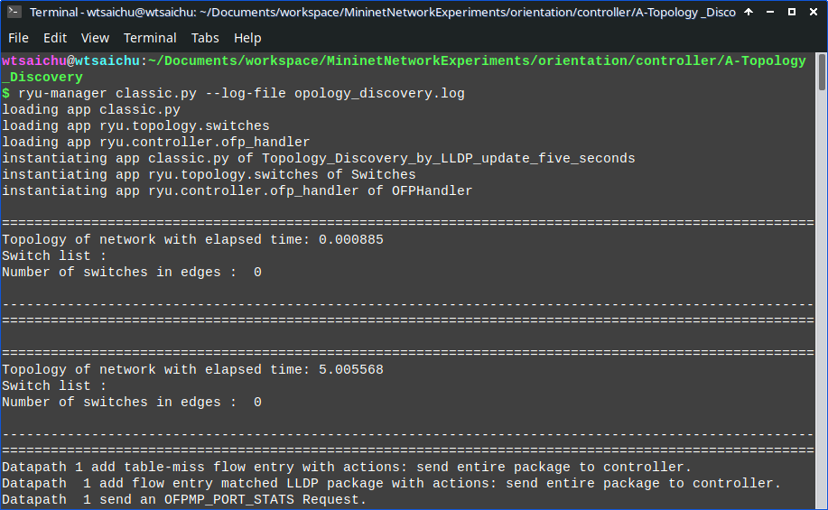

# Topology discovery

Tags: Mininet, ryu
Branch: Orientation
Date: 15. August 2023 → 22. August 2023

.png)

### Table-miss flow entry

```python
# 設定 table-miss flow entry : 
match = ofp_parser.OFPMatch()   # 匹配所有封包
actions = [ofp_parser.OFPActionOutput(ofproto.OFPP_CONTROLLER, ofproto.OFPCML_NO_BUFFER)]   # 將整個封包發送到控制器
insturctions = [ofp_parser.OFPInstructionActions(ofproto.OFPIT_APPLY_ACTIONS, actions)] # 立即執行該動作
flow_add_modification_message = ofp_parser.OFPFlowMod(  # 添加 flow entry message ,屬於Controller-to-switch Messages
datapath = datapath,    # 交換機
match = match,  # 匹配項目
	cookie = 0, # Cookie 為 0
	command = ofproto.OFPFC_ADD,    # 0, /* New flow. */ 標示消息類型為 OFPFC_ADD
	idle_timeout = 0,   # 不限制匹配過期時間 （永久存在）
	hard_timeout = 0,   # 不限制硬性過期時間 （永久存在）
	priority = 0,   # 優先級為 0 （ table-miss 的必要條件）
	instructions = insturctions # 執行的動作
)
datapath.send_msg(flow_add_modification_message)    # 發送往交換機
self.logger.debug("Datapath {0} add table-miss flow entry with actions: send entire package to controller.".format(datapath.id))    # 顯示添加完成的 log
```

# Flow entry

| priority | name | match |  | datapath | actions |
| --- | --- | --- | --- | --- | --- |
|  |  | eth_type | in_port |  | output port |
| 0 | table-miss | - |  | ALL | CONTROLLER |
| 1 | lldp | 34525 | - | ALL | - |
| 2 | - | 34525 | ✓ | ALL | - |

.png)

# **Consequent**

**Command**

```
ryu-manager classic.py --log-file opology_discovery.log
```



**Topology**


# **EventOFPSwitchFeatures**

```python
# 控制器事件響應 switch_features_handler 響應 OFPT_FEATURES_REPLY
@set_ev_cls(ofp_event.EventOFPSwitchFeatures, CONFIG_DISPATCHER)
def switch_features_handler(self, event):
    # 取得資料
    message = event.msg  # 事件的訊息
    datapath = message.datapath  # 數據平面的交換機（datapath）結構
    ofproto = datapath.ofproto  # OpenFlow 協議相關訊息
    ofp_parser = datapath.ofproto_parser  # 創建和解析 OpenFlow message

    # 設定 table-miss flow entry :
    match = ofp_parser.OFPMatch()  # 匹配所有封包
    actions = [ofp_parser.OFPActionOutput(ofproto.OFPP_CONTROLLER, ofproto.OFPCML_NO_BUFFER)]  # 將整個封包發送到控制器
    insturctions = [ofp_parser.OFPInstructionActions(ofproto.OFPIT_APPLY_ACTIONS, actions)]  # 立即執行該動作
    flow_add_modification_message = ofp_parser.OFPFlowMod(  # 添加 flow entry message , 屬於Controller-to-switch Messages
        datapath=datapath,  # 交換機
        match=match,  # 匹配項目
        cookie=0,  # Cookie 為 0
        command=ofproto.OFPFC_ADD,  # 0, /* New flow. */ 標示消息類型為 OFPFC_ADD
        idle_timeout=0,  # 不限制匹配過期時間 （永久存在）
        hard_timeout=0,  # 不限制硬性過期時間 （永久存在）
        priority=0,  # 優先級為 0 （ table-miss 的必要條件）
        instructions=insturctions  # 執行的動作
    )
    datapath.send_msg(flow_add_modification_message)  # 發送往交換機
    self.logger.info(
        "Datapath {0} add table-miss flow entry with actions: send entire package to controller.".format(
            datapath.id))  # 顯示添加完成的 log

    self.datapaths.update({datapath.id: datapath})  # 初始化交換機物件
    self.switch_ports.update({datapath.id: {}})  # 初始化交換機與 port 的對應關係
    self.switch_graph.update({datapath.id: {}})  # 初始化交換機的 edge with weight

    match = ofp_parser.OFPMatch(eth_type=34525)  # 匹配所有封包
    actions = [ofp_parser.OFPActionOutput(ofproto.OFPP_CONTROLLER, ofproto.OFPCML_NO_BUFFER)]  # 將整個封包發送到控制器
    insturctions = [ofp_parser.OFPInstructionActions(ofproto.OFPIT_APPLY_ACTIONS, actions)]  # 立即執行該動作
    flow_add_modification_message = ofp_parser.OFPFlowMod(  # 添加 flow entry message , 屬於Controller-to-switch Messages
        datapath=datapath,  # 交換機
        match=match,  # 匹配項目
        cookie=0,  # Cookie 為 0
        command=ofproto.OFPFC_ADD,  # 0, /* New flow. */ 標示消息類型為 OFPFC_ADD
        idle_timeout=0,  # 不限制匹配過期時間 （永久存在）
        hard_timeout=4,  # 4 秒後過期
        priority=1,  # 優先級為 1
        instructions=insturctions  # 執行的動作
    )
    datapath.send_msg(flow_add_modification_message)  # 發送往交換機
    self.logger.info(
        "Datapath {:2d} add flow entry matched LLDP package with actions: send entire package to controller.".format(
            datapath.id))  # 顯示添加完成的 log

    self.send_port_desc_stats_request(datapath)  # 發送一個 send_port_desc_stats_request 給各個switch
    self.logger.info("Datapath {:2d} send an OFPMP_PORT_STATS Request.".format(
        datapath.id))  # 顯示添加完成的 log
    self.show_topology_lldp()  # 顯示拓樸 （LLDP）
```

做出的工作：

1. 添加 table-miss flow entry
2. 添加匹配 LLDP (eth_type = 34525) 且優先級為 1 的 flow entry
3. 發送 send_port_desc_stats_request
4. 顯示拓樸

# port_desc_stats_reply_handler

```python
# OFPPortDescStatsRequest 的響應，統計 port 的資訊
@set_ev_cls(ofp_event.EventOFPPortDescStatsReply, MAIN_DISPATCHER)
def port_desc_stats_reply_handler(self, event):
    # 取得訊息
    datapath = event.msg.datapath  # 數據平面的交換機（datapath）結構
    ofproto = datapath.ofproto  # OpenFlow 協議相關訊息
    ofp_parser = datapath.ofproto_parser  # 創建和解析 OpenFlow message

    ports = {}  # 交換機上的 port

    # 遍歷 event 中收到的每個 port 的統計訊息
    for statistic in event.msg.body:
        if statistic.port_no <= ofproto.OFPP_MAX:  # 如果 port_no(port number) 小於或等於 OFPP_MAX（最大的 port number ) -> 表示該 port 有效且不是 reserved port
            ports.update({statistic.port_no: statistic.hw_addr})  # 添加有效的 port 訊息  port number : MAC 地址
    self.ports_details.update({datapath.id: ports})  # 更新該交換機的 port 統計資訊

    ports_string = ""
    for key in self.ports_details[datapath.id].keys():
        ports_string += " {} : {:2s}, ".format(key, self.ports_details[datapath.id][key])
    self.logger.info("Switch{:2d} with ports infromation : {}".format(datapath.id, ports_string))

    # 遍歷 ports 的每個 port, 並且為該 port 發送 LLDP 封包
    for port_number in ports.keys():
        ingress_port = int(port_number)  # 輸入 port 為 port 的 port number
        match = ofp_parser.OFPMatch(eth_type=34525, in_port=ingress_port)  # 如果封包匹配 in_port = ingress_port 且 為 LLDP 類型

        for other_port_number in ports.keys():  # 遍歷其他非 ingress_port 的 port
            if other_port_number != ingress_port:  # 如果是其他 port
                out_port = other_port_number  # 轉發 port 為 other_port
                self.send_lldp_packet(datapath, other_port_number, ports[other_port_number], 1)  # 發送 LLDP 封包

                actions = [
                    ofp_parser.OFPActionOutput(out_port),
                    ofp_parser.OFPActionOutput(ofproto.OFPP_CONTROLLER, ofproto.OFPCML_NO_BUFFER)
                ]  # 進行轉發封包的 action : 轉發到 output_port 以及控制器
                insturctions = [
                    ofp_parser.OFPInstructionActions(ofproto.OFPIT_APPLY_ACTIONS, actions)
                ]  # 立即執行該動作
                flow_add_modification_message = ofp_parser.OFPFlowMod(
                    datapath=datapath,  # 交換機
                    match=match,  # 匹配項目
                    cookie=0,  # Cookie 為 0
                    command=ofproto.OFPFC_ADD,  # 0, /* New flow. */ 標示消息類型為 OFPFC_ADD
                    idle_timeout=0,  # 不限制匹配過期時間 （永久存在）
                    hard_timeout=4,  # 不限制硬性過期時間 （永久存在）
                    priority=2,  # 優先級為 2，為了覆蓋掉預設的 LLDP 封包轉發動作
                    instructions=insturctions  # 執行的動作
                )
                datapath.send_msg(flow_add_modification_message)  # 發送往交換機
                self.logger.info(
                    "Switch{:2d} add a flow entry with match field : eth_type = 34525 , in_port = {}".format(
                        datapath.id, ingress_port))
```

.png)

這個階段要作的事情

1. 取得交換機上所有 port 的訊息
2. 更新所有非 reserved port
3. 發送  LLDP 封包到其他 port
4. 添加 flow entry (match : inport = [ingress_port], eth_type = 34525)

## send_lldp_packet

```python
# 取得 port 的資訊
def send_port_desc_stats_request(self, datapath):
    ofp_parser = datapath.ofproto_parser  # 創建和解析 OpenFlow message
    
    # 取得 switch port 的 mac address
    request = ofp_parser.OFPPortDescStatsRequest(datapath, 0)  # 請求有關交換機 port 的詳細訊息
    datapath.send_msg(request)  # 發送一條 OFPPortDescStatsRequest ，透過 OFPPortDescStatsReply 取得 port 資訊
```

送出 OFPPortDescStatsRequest 觸發 OFPPortDescStatsReply，通常使用在一開始與監控程式

# packet_in_handler

```python
# 響應封包進入控制器的事件
@set_ev_cls(ofp_event.EventOFPPacketIn, MAIN_DISPATCHER)
def packet_in_handler(self, event):
    message = event.msg  # message of event
    datapath = event.msg.datapath  # 數據平面的交換機（datapath）結構

    package = packet.Packet(data=message.data)  # 取得封包
    datapath_id = datapath.id  # 來源的交換機
    ingress_port = message.match['in_port']  # 輸入的 port

    package_ethernet = package.get_protocol(ethernet.ethernet)  # ethernet frame

    # 過濾協議為 LLDP 的封包
    if package_ethernet.ethertype == ether_types.ETH_TYPE_LLDP:
        package_LLDP = package.get_protocol(lldp.lldp)  # 取得 LLDP 封包
        lldp_datapathid = package_LLDP.tlvs[0].chassis_id.decode()  # 連接到的目標交換機 ID
        lldp_ingress_port = package_LLDP.tlvs[1].port_id.decode()  # 連接到的目標交換機 port

        origin_graph = self.switch_graph[datapath_id]  # 未更新的圖[本交換機]
        origin_graph.update({lldp_datapathid: 1})  # 更新圖[本交換機]，權重為 1
        self.switch_graph.update({datapath_id: origin_graph})  # 更新圖到全圖

        origin_switch_port = self.switch_ports[datapath_id]  # 未更新的交換機與 port 的連接關係[本交換機]
        origin_switch_port.update({ingress_port: lldp_datapathid})  # 更新交換機與 port 的連接關係[本交換機]，port_number : connected_switch
        self.switch_ports.update({datapath_id: origin_switch_port})  # 更新交換機與 port 的連接關係[整個拓樸]

        # 這個解註解會打印出交換機相連的邊以及 port
        # print("switch{:2d} : {} <---> switch{:2s} : {}".format(datapath_id, ingress_port, lldp_datapathid, lldp_ingress_port))ㄓㄣ
```

針對 LLDP 封包作處理，透過下列資訊更新連接的邊

| switchA | switchA connected port | switchB | switchB connected port |
| --- | --- | --- | --- |
| datapath_id | ingress_port | lldp_datapathid | lldp_ingress_port |

如果要顯示邊的話，可以解註解最下面的程式碼

# send_lldp_packet

發送 LLDP 封包

```python
# 發送 LLDP 封包
def send_lldp_packet(self, datapath, port, hardware_address, ttl):
    ofproto = datapath.ofproto  # OpenFlow 協議相關訊息
    ofp_parser = datapath.ofproto_parser  # 創建和解析 OpenFlow message

    # 產生一個封包 object
    lldp_package = packet.Packet()

    # 添加 ethernet header
    lldp_package.add_protocol(
        ethernet.ethernet(
            ethertype=ether_types.ETH_TYPE_LLDP,  # ethertype: LLDP
            src=hardware_address,  # src: 發送 LLDP 封包的 switch port 的 mac 地址
            dst=lldp.LLDP_MAC_NEAREST_BRIDGE  # dst: LLDP_MAC_NEAREST_BRIDGE 連接交換機最近的 mac
        )
    )

    chassis_id = lldp.ChassisID(
        subtype=lldp.ChassisID.SUB_LOCALLY_ASSIGNED, chassis_id=str(datapath.id)
    )  # chassis_id: 發送 LLDP 封包的 switch id
    port_id = lldp.PortID(
        subtype=lldp.PortID.SUB_LOCALLY_ASSIGNED, port_id=str(port)
    )  # port_id: 發送 LLDP 封包的 switch port id

    chassis_id.chassis_id = chassis_id.chassis_id.encode()  # 必須轉換成 byte 不然會在 serialize 出錯
    port_id.port_id = port_id.port_id.encode()

    # 添加 LLDP TLV（ Type / Length / Value )
    ttl = lldp.TTL(ttl=ttl)  # 存活時間
    end = lldp.End()
    tlvs = (chassis_id, port_id, ttl, end)  # tlvs = 設備 ID, port ID , time-to-live , end
    lldp_package.add_protocol(lldp.lldp(tlvs))  # 加入 LLDP header
    lldp_package.hop_limit = ttl  # 設定跳數限制

    lldp_package.serialize()  # 序列化 LLDP 封包

    data = lldp_package.data  # 將 data 指定為封包的二進位制值
    actions = [ofp_parser.OFPActionOutput(port=port)]  # Action 指定為將封包轉發到指定 port

    # 創建一條 OFPPacketOut message 將封包發送到交換機
    out = ofp_parser.OFPPacketOut(
        datapath=datapath,  # 交換機
        buffer_id=ofproto.OFP_NO_BUFFER,  # 將整個封包傳送出去
        in_port=ofproto.OFPP_CONTROLLER,  # 指定從控制器傳入
        actions=actions,  # 將封包轉發到指定 port
        data=data,  # 封包資料
    )
    datapath.send_msg(out)  # 將封包發送到交換機
    self.logger.info(
        "Switch{:2d} send a LLDP packet with chassis_id = {:2s}, port_id = {:2s}, mac address = {} ttl = {}".format(
            datapath.id,
            chassis_id.chassis_id.decode(),
            port_id.port_id.decode(),
            hardware_address,
            ttl,
        )
    )
```

通常，存活時間我會設為 1

# show_topology_lldp

```python
# Display topology (LLDP)
def show_topology_lldp(self):
    self.print_split_line('=', True)  # Starting separator line
    now_time = time.time()  # Get current time
    elapsed_time = now_time - self.start_time  # Get elapsed time

    self.logger.info("Topology of network with elapsed time: {:.6f}".format(elapsed_time))  # Display execution time
    switch_list_string = ""
    for id in self.datapaths.keys():  # Iterate through switches
        switch_list_string += " {:2d}, ".format(id)  # Add switch information to the message
    self.logger.info("Switch list: " + switch_list_string[:-1])  # Print the message

    switch_in_edges = set()  # Keep track of connected switches
    for datapath_id in self.switch_graph.keys():  # Iterate through individual switches
        for connected_switch in self.switch_graph[datapath_id].keys():  # Check connected ports one by one
            switch_in_edges.add(int(datapath_id))  # Add this switch to the set of connected switches
            switch_in_edges.add(int(connected_switch))  # Add the connected switch to the set

    self.logger.info("Number of switches in edges: {:2d}".format(len(switch_in_edges)))  # Output connected switches information
    self.print_split_line('-', True)  # Print separator line

    for datapath_id in self.switch_ports.keys():  # Iterate through switch connection information
        if self.switch_ports[datapath_id] != {}:  # Filter connected switches
            ports_connect_string = ""
            for connected_port in self.switch_ports[datapath_id].keys():  # Iterate through switch connection information
                ports_connect_string += " port{} --> switch{:2s},".format(connected_port, self.switch_ports[datapath_id][connected_port])  # Display port connections
            self.logger.info("switch{:2d} with edges: {}".format(datapath_id, ports_connect_string[:-1]))  # Output connection information, -1 to remove trailing ','
    self.print_split_line('=', False)  # Ending separator line
```

# Monitoring every 5s

```python
# Switch startup initialization function
def __init__(self, *args, **kwargs):
    super(Topology_Discovery_by_LLDP_update_five_seconds, self).__init__(*args, **kwargs)
    self.discover_thread = hub.spawn(self.every_five_second_monitoring)  # Create a thread for monitoring every 5 seconds

    self.start_time = time.time()  # Record startup time

    self.datapaths = {}  # Store Datapath objects for the entire network

    self.ports_details = {}  # Port statistics information for switches in the network
    self.switch_ports = {}  # Mapping of connected switches and their ports
    self.switch_graph = {}  # Graph of connected switches with edges and weights
```

## Thread

```python
# Function executed by the monitoring thread every 5 seconds
def every_five_second_monitoring(self):
    while True:
        try:
            for datapath_id in self.datapaths:
                self.send_port_desc_stats_request(self.datapaths[datapath_id])  # Trigger EventOFPPortDescStatsRequest to update topology
            self.show_topology_lldp()  # Display updated topology
        except KeyError:
            self.logger.info("Topology discovery encountered KeyError")
        hub.sleep(5)  # Sleep for 5 seconds
```