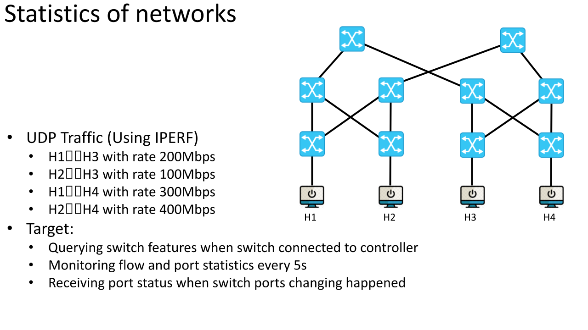

# 112_Aug_Orientierung

Tags: mininet, orientation
Datum: 12. September 2023
Status: Im Gange

Hier beginnt alles, es stehen vier Experimente an.
Um es ganz klar auszudrücken: Dieses Experiment wurde von meinen Vorgesetzten als Lebensmittelverschwendung beschimpft, daher empfehle ich, es nicht zu erwähnen, obwohl ich sehr hart gearbeitet habe.

# **Flow entries management**

.png)

## Ping test (Matching switch port and IP/MAC Address)

- H1🡨🡪H3
- H2🡨🡪H4

## IPERF test (Matching IP and TCP port)

- H1🡨🡪H4
- H3🡨🡪H4

## Meter test (Matching IP and UDP, limit users’ bandwidth)

- H1🡨🡪H3 with rate 300Mbps
- H3🡨🡪H4 with rate 200Mbps

# **Statistics of networks**

## UDP Traffic (Using IPERF)

- H1🡨🡪H3 with rate 200 Mbps
- H2🡨🡪H3 with rate 100 Mbps
- H1🡨🡪H4 with rate 300 Mbps
- H2🡨🡪H4 with rate 400 Mbps

## Target:

- Querying switch features when switch connected to controller
- Monitoring flow and port statistics every 5s
- Receiving port status when switch ports changing happened

# **Topology discovery**

- Using topology discovery protocol (LLDP) to discovery the network topology
Switch
    - Link/connection …
- Refresh topology every 5s

# **Making a routing decision**