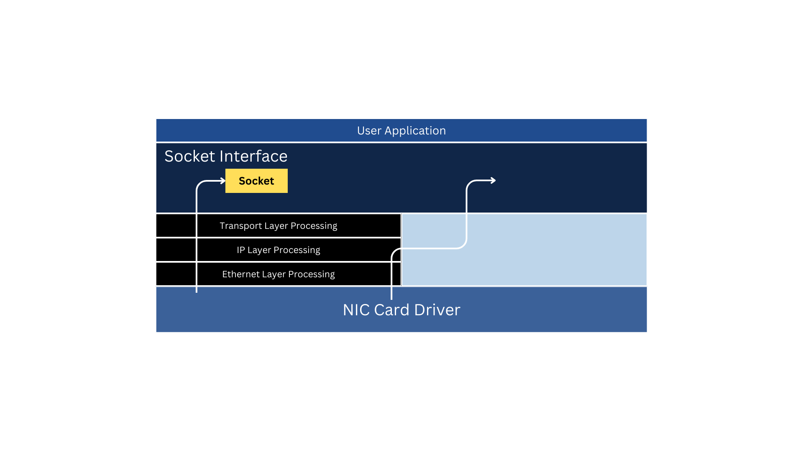
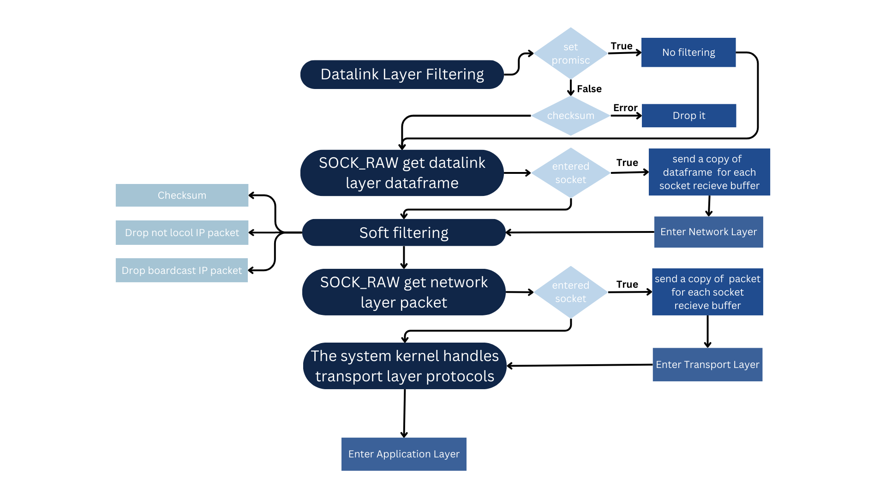

# Socket : Raw socket

Tags: C, orientation
Datum: 12. September 2023
Status: Erledigt

在電腦網路中, 原始通訊端（raw socket）是一種網路通訊端，**允許直接傳送/接收IP協定封包**而不需要任何傳輸層協定格式

Raw Socket 捕獲到的數據是內核協議棧中封包的一份**拷貝**，內核協議棧還會按照原先的決策繼續處理該封包

SOCK_RAW Raw Socket 編程可以接收到本機**網卡上的 data frame 或者封包**

# Socket

SOCK_STREAM ➡️ TCP

SOCK_DGRAM  ➡️ UDP

幾乎所有的應用都可以使用這兩種 socket 來實現，這兩種 socket 的局限在於它們**只能處理數據載荷**，封包的 header 在到達用戶程序的時候已經被移除了



SOCK_RAW ➡️ Raw

.png)

## Die Verwendung

1. 用於**安全相關的應用程式**，如 nmap
2. 用於**路由協定**，例如 IGMPv4、開放式最短路徑優先協定 (OSPF)、網際網路控制訊息協定 (ICMP)
3. 實現 sniffer
4. IP 欺騙

## Das Merkmal

1. 不需要任何傳輸層協定格式
2. 可以繞過系統內核的協議棧，使得用戶可以自行構造數據包
3. 原始套接字繞過正常的TCP / IP處理並將數據包發送到特定的用戶應用程序
4. 可以實現上至應用層的數據操作，也可以實現下至鏈路層的數據操作
5. 要求比應用開發更高的權限
6. 對於網絡層IP數據包的接收、發送，RAW SOCKET 接口是通用的，具有可移植性
7. 對於數據鏈路層數據幀的接收、發送，不同的系統有不同的機制，不具有可移植性
8.  Raw Socket 優先處理給其他協議處理器（內核協議處理器）之前

# Ergänzung

1. UDP 和 TCP 封包從不傳送給一個 raw socket
2. 在將一個 IP 封包傳送給 raw socket 之前，內核需要選擇匹配的 raw socket
    1. 封包的協議域必須與接收 raw socket 指定的協議類型匹配
    2. 如果 raw socket 調用了 bind 函數來綁定本機 IP 地址，則到達的 IP 封包的源 IP 地址必須和綁定的 IP 相匹配
    3. 如果 raw socket 調用了 connect 函數來指定對方的 IP 地址，則到達的 IP 封包的源 IP 地址必須和指定的相匹配
3. 一般來說，原始套接字可以接收到：
A. 任何對內核來說是未知的上層協議的 IP packet message
B. 大部分類型的 ICMP packet message
C. 所有的 IGMPpacket message
4. 如果 protocol 是 IPPROTO_RAW(255) ，這個socket只能用來發送 IP 封包，而不能接收任何的封包
5. 對於 protoco l為 0（IPPROTO_IP) 的 raw socket ，用於接收任何的 IP 封包
6. 如果 protocol 既不是 0 也不是 255 ，那麼 sock_raw 既可以接收封包，也可以發送封包
7. 如果 protocol 為 IPPROTO_RAW，則默認設置 IP_HDRINCL 選項。
8. 雖然設置 IP_HDRINCL 選項，可以由使用者自行指定IP頭，但 IP_HDRINCL 選項還是會修改使用者指定的IP頭，規則如下：
    1. IP 頭校驗和（CheckSum）：總是填充
    2. 源 IP 地址：如果為 0，則被自動填充為本機的 IP 地址
    3. 包ID（packet ID）：如果為 0，則被自動填充
    4. IP包的總長度：總是被填充
9. 如果 raw socket 沒有使用 connect 函數綁定對方地址時，則應使用 **sendto 或 sendmsg** 函數來發送封包，在函數參數中指定對方地址
如果使用了 connect 函數，則可以直接使用 **send、write 或 writev** 函數來發送封包
10. 如果 raw socket 調用了 bind 函數，則發送封包的源 IP 地址將是 bind 函數指定的地址
    1. 否則，內核將以發接口的主 IP 地址填充
    2. 如果設置了 IP_HDRINCL 選項，則必須手工填充每個發送封包的源 IP 地址

# Prinzip des Empfangens von SOCK_RAW-Datenpaketen

1. 網卡對該 dataframe 進行硬過濾（數據鏈路層過濾）
首先進行數據鏈路層校驗和處理，如果校驗和出錯，直接仍掉；然後根據網卡的模式不同會有不同的動作：
如果設置了 promisc 混雜模式的話，則**不做任何過濾**直接交給下一層輸入例程，否則非本機mac或者廣播mac會被直接丟棄
2. 向用戶層遞交數據鏈路層 dataframe ———— SOCK_RAW 捕獲數據鏈路層 dataframe 
在進入網絡層之前，系統會檢查系統中是否有通過 socket(AF_PACKET, SOCK_RAW, ...) 創建的 socket
如果有並且與指定的協議相符的話，系統就給每個這樣的 socket 接收緩衝區發送一個  dataframe 拷貝，然後進入網絡層。
3. 進入網絡層（IP層過濾）———— 三層
IP層會對該封包進行軟過濾————就是檢查校驗或者丟棄非本機 IP 或者廣播 IP 的封包等。
4. 向用戶層遞交網絡層封包 ———— SOCK_RAW 捕獲網絡層 IP 封包
檢查系統中是否有通過socket(AF_INET, SOCK_RAW, ...)創建的 socket；
如果有的話並且協議相符，系統就給每個這樣的 socket 接收緩衝區發送一個封包拷貝（不管在任何情況下，永遠都包含IP封包頭）。
然後進入傳輸層。
5. 進入傳輸層（如TCP、UDP等例程）———— 四層
這一步由系統內核來處理運輸層的協議，用戶層無法干涉。
處理完之後，如果合法，將向用戶層遞交數據，進而進入用戶層處理。
6. 進入用戶層（如HTTP、FTP等）
這一層在用戶態，由用戶應用程序來完成
    
    
    

# Erstellen Sie einen Raw-Socket

要創建套接字，必須知道 **socket 族、 socket 類型和協議**三個方面。

```c
#include <sys/types.h>          /* See NOTES */
#include <sys/socket.h>

int socket(int domain, int type, int protocol);

socket(AF_INET, SOCK_RAW, IPPROTO_XXX)           // 發送、接收網絡層IP數據包
socket(PF_PACKET, SOCK_RAW, htons(ETH_P_XXX))    // 發送、接收數據鏈路層數據幀（目前只有Linux支持）
socket(AF_INET, SOCK_PACKET, htons(ETH_P_XXX))   // 過時了
```

內核中 socket 是**一層一層進行抽象展示**的，把共性的東西抽取出來，這樣對外提供的接口可以盡量的統一

內核中把套接字的定義會抽像出來展示，如struct sock->struct inet_sock->struct tcp_sock從抽像到具體。 Socket函數中的三個參數其實就是把抽象的socket具體化的條件，domain參數決定了圖中所示的第二層通信域，type決定了第三層的通信模式，protocol決定了第四層真正的通信協議。

.png)

對於 raw socket ，domain（family）套接字族可以是AF_INET、PF_INET、AF_PACKET和PF_PACKET；套接字類型是SOCK_RAW；至於協議，可以查閱 [if_ether.h](https://sites.uclouvain.be/SystInfo/usr/include/linux/if_ether.h.html) 頭文件

| Name | Zweck |
| --- | --- |
| AF_UNIX,AF_LOCAL | 本地通訊 |
| AF_INET | IPv4 網路通訊 |
| AF_INET | IPv6 網路通訊 |
| AF_PACKET | 鏈路層通訊 |

# Analysieren Sie ihre Fähigkeiten weiter

## 第一種

```c
socket(AF_INET, SOCK_RAW, IPPROTO_XXX)
```

IPPROTO_XXX 是 /etc/protocols 文件中描述的 protocol ，指明要接收的包含在IP數據包中的協議包。

## übernehmenung

這個SOCKET接收的數據是包含 IP header 的 IP 封包（不管protocol是任何協議），並且是已經**重組好**的 IP 包。

默認情況下，發送的數據是不包含 IP header 的IP 封包負載部分（如TCP或UDP包），網絡層會自動添加 IP header ；如果使用 setsocketopt 函數設置了 IP_HDRINCL 選項後，寫入的數據就必須包含 IP header ，即 IP header 在用戶層由使用者自己構建。例子：

```c
int on = 1;
if (setsockopt(sockfd, IPPROTO_IP, IP_HDRINCL, &on, sizeof(on)) < 0) {
	printf("Set IP_HDRINCL failed\n");
}
```

這種 socket 用來寫個 ping 程序比較適合

## 第二種

```c
socket(PF_PACKET, SOCK_RAW, htons(ETH_P_XXX))
```

這種 sovket 可以**監聽網卡上的所有 dataframe** ；最後以太網 CRC 從來都不算進來的，因為內核已經判斷過了，對程序來說沒有任何意義了。

## übernehmenung

1. 發往本地 mac 的 dataframe
2. 從本機發送出去的 dataframe (第 3 個參數需要設置為 ETH_P_ALL)
3. 非發往本地 mac 的 dataframe (網卡需要設置為 promisc 混雜模式)

## Vertragsart

| Vertragsart | Code | Einführung |
| --- | --- | --- |
| ETH_P_IP | 0x800 | 只接收發往本機 mac 的 IP 類型的 dataframe |
| ETH_P_ARP | 0x806 | 只接收發往本機 ARP 的 IP 類型的 dataframe |
| ETH_P_ARP | 0x8035 | 只接收發往本機 RARP 的 IP 類型的 dataframe |
| ETH_P_ALL | 0x3 | 接收發往本機 mac 的所有類型（IP、ARP、RARP）的dataframe 
並接收從本機發出的所有類型的 dataframe 
（混雜模式打開的情況下，會接收到非發往本地 mac 的 dataframe ） |

## schickung

需要自己組織整個 ethernet dataframe，所有相關的地址使用struct sockaddr_ll 而不是 struct sockaddr_in（因為協議簇是 PF_PACKET 不是 AF_INET 了————應該稱 PF_INET）。

這種socket大小通吃，下面是一段相關的代碼:

```c
int sockfd = socket(PF_PACKET, SOCK_RAW, htons(ETH_P_ALL));
struct sockaddr_ll sll;
memset( &sll, 0, sizeof(sll) );
sll.sll_family = AF_PACKET;
struct ifreq ifstruct;
strcpy(ifstruct.ifr_name, "eth0");
ioctl(sockfd, SIOCGIFINDEX, &ifstruct);
sll.sll_ifindex = ifstruct.ifr_ifindex;
sll.sll_protocol = htons(ETH_P_ALL);
if(bind(fd, (struct sockaddr *) &sll, sizeof(sll)) == -1 )
    perror("bind()");

int set_promisc(char *interface, int fd) {
    struct ifreq ifr;
    strcpy(ifr.ifr_name, interface);
    if(ioctl(fd, SIOCGIFFLAGS, &ifr) == -1) {
        perror("iotcl()");
        return -1;
    }
    ifr.ifr_flags |= IFF_PROMISC;
    if(ioctl(fd, SIOCSIFFLAGS, &ifr) == -1) {
        perror("iotcl()");
        return -1;
    }
    return 0;
}

int unset_promisc(char *interface, int fd) {
    struct ifreq ifr;
    strcpy(ifr.ifr_name, interface);
    if(ioctl(fd, SIOCGIFFLAGS, &ifr) == -1) {
        perror("iotcl()");
        return -1;
    }
    ifr.ifr_flags &= ~IFF_PROMISC;
    if(ioctl(fd, SIOCSIFFLAGS, &ifr) == -1) {
        perror("iotcl()");
        return -1;
    }
    return 0;
}

```

## 第三種

```c
socket(AF_INET, SOCK_PACKET, htons(ETH_P_ALL))     // 這個過時了
```

最好不要用
總結使用方法:

1. 如果只想收到發往本機某種協議的 IP 封包的話，用第一種就足夠了
2. 更多的詳細的內容請使用第二種，包括 ETH_P_ALL 參數和混雜模式都可以使它的能力不斷的加強

# Anmerkung

## 協議簇和地址簇、AF_PACKET和PF_PACKET

協議簇指代**底層進行數據傳遞時的協議**，每種協議都相應的有一種地址格式，這樣才能將數據由一個地方傳遞到另外一個地方。在早期，有人提出一種協議簇可能對應多種地址格式，因此將協議簇和地址簇區分開來，換句話說就是，協議簇與地址簇是一對多的關係；但到目前為止，每種協議簇都只對應一種地址簇，好像還沒有哪種協議簇對應多個地址簇。

**協議簇以 PF_ 開頭，地址簇以 AF_ 開頭**。由於目前的協議簇和地址簇都是一一對應的，因此，相對應的協議簇和地址簇除了開頭不同，其他部分都是相同的，如：PF_INET 和 AF_INET、PF_PACKET 和 AF_PACKET。

理論上來說，對於socket 函數的第一個參數 **domain 應該使用地址簇**，而不是使用協議簇，因為一個協議簇可以對應多個地址簇，而 socket 在綁定 bind 及傳遞數據時，是要根據不同的地址簇來區分不同類型的地址參數的。

最好還是使用地址簇最好，即**最好使用以 AF_ 開關的宏或常量**。

因此，上述討論  socket(PF_PACKET, SOCK_RAW, htons(ETH_P_XXX)) 中的 PF_PACKET，也可以換成 AF_PACKET`。

# Was Sie bei der Verwendung von Raw-Sockets beachten sollten

1. 對於UDP/ TCP產生的 IP 封包,內核不將它傳遞給任何 raw socket
2. 對於 ICMP 和 EGP 等使用 IP 封包承載數據但又在傳輸層之下的協議類型的 IP 封包,內核會將這些 IP 封包複製一份傳遞給協議類型匹配的 raw socket
3. 對於不能識別協議類型的封包,內核進行必要的校驗,然後會查看是否有類型匹配的 raw socket 負責處理這些數據
如果有的話,就會將這些 IP 封包複製一份傳遞給匹配的 raw socket 
否則,內核將會丟棄這個IP數據包,並返回一個ICMP主機不可達的消息給源主機
4. 如果 raw socket bind 綁定了一個地址,核心只將目的地址為本機IP地址的封包傳遞給  raw socket如果某個原始套接字沒有bind地址,核心就會把收到的所有 IP 封包發給這個 raw socket.
5. 如果 raw socket 調用了connect函數,則核心只將源地址為connect連接的IP地址的IP數據包傳遞給這個  raw socket .

(6):如果 raw socket 沒有調用bind和connect函數,則核心會將所有協議匹配的 IP 封包傳遞給這個 raw socket .

# Code : Implement ICMP

```c
#include <stdio.h>
#include <stdlib.h>
#include <string.h>
#include <unistd.h>
#include <sys/socket.h>
#include <netinet/in.h>
#include <netinet/ip.h>
#include <netinet/ip_icmp.h>
#include <arpa/inet.h>

#ifndef _DEBUG_COLOR_
#define _DEBUG_COLOR_
    #define KDRK "\x1B[0;30m"
    #define KGRY "\x1B[1;30m"
    #define KRED "\x1B[0;31m"
    #define KRED_L "\x1B[1;31m"
    #define KGRN "\x1B[0;32m"
    #define KGRN_L "\x1B[1;32m"
    #define KYEL "\x1B[0;33m"
    #define KYEL_L "\x1B[1;33m"
    #define KBLU "\x1B[0;34m"
    #define KBLU_L "\x1B[1;34m"
    #define KMAG "\x1B[0;35m"
    #define KMAG_L "\x1B[1;35m"
    #define KCYN "\x1B[0;36m"
    #define KCYN_L "\x1B[1;36m"
    #define WHITE "\x1B[0;37m"
    #define WHITE_L "\x1B[1;37m"
    #define RESET "\x1B[0m"
#endif

// 做 checksum 運算, 驗證資料有無毀損
unsigned short checksum(unsigned short *buffer, int buffersize){
    unsigned long sum = 0xffff; // 用 0xffff 初始化總和

    while(buffersize > 1){  // 以 16 bits（2 words）塊的形式處理緩衝區
        sum += *buffer; // 將 buffer 指向的 16 位值添加到 sum 中
        buffer++;   // 移至緩衝區中的下一個 16 位值
        buffersize -= 2;    // 將剩餘緩衝區大小減少 2 words
    }

    if(buffersize == 1) // 如果剩下奇數 word ，則將其作為 16 位值添加到總和中
        sum += *(unsigned char*)buffer; 

    // 處理任何進位（溢出）並將它們折疊回總和中
    sum = (sum & 0xffff) + (sum >> 16);
    sum = (sum & 0xffff) + (sum >> 16);

    return ~sum;    // 返回最終和的補碼（bitwise NOT）作為校驗和
}

int main(int argc, char *argv[]){

    int socket_dentifier;
    struct icmphdr hdr;
    struct sockaddr_in addr;    // sockaddr_in 的結構用來存取網路相關的應用， in 指的是 internet，sockaddr_in 專門用來存 IPv4 的相關地址
    int num;
    char buffer[1024];  // 緩衝區
    struct icmphdr *icmphdrptr;
    struct iphdr *iphdrptr;

    
    if(argc < 2){  // 如果沒有給定參數（目標 IP 位址）
        printf("argument lost: correct command type : { sudo %s [IPADDR] } .\n", argv[0]); // 提示你缺少參數
        exit(-1);   // 以 -1 結束程式
    }

    addr.sin_family = PF_INET; // 2 bytes 地址族 : IPv4

    // 將使用者輸入的 IP 轉成 network order
    num = inet_pton(PF_INET, argv[1], &addr.sin_addr);  // 將 IP 地址從人類可讀的格式轉換為網絡順序格式
    if(num < 0){    //如果轉換過程中發生錯誤，返回-1
        perror("inet_pton");    // 打印帶有錯誤描述的錯誤消息
        exit(-1);   // 以 -1 結束程式
    }

    // 開一個 IPv4 的 RAW Socket , 並且準備收取 ICMP 封包
    socket_dentifier = socket(PF_INET, SOCK_RAW, IPPROTO_ICMP);   // IPv4 協定, socket 的類型 : SOCK_RAW, 協議 : ICMP
    if(socket_dentifier < 0){
        perror("socket");   // 打印帶有錯誤描述的錯誤消息
        exit(-1);   // 以 -1 結束程式
    }

    // 清空結構內容
    memset(&hdr, 0, sizeof(hdr)); // 填充 hdr 的前n個字符為 0

    // 初始化 ICMP Header
    hdr.type = ICMP_ECHO;   // 指定 ICMP 消息的類型為 ICMP Echo Request 消息類型，用於 ping 遠程主機
    hdr.code = 0;   // 通常提供與 ICMP 消息類型相關的附加信息，但對於 ICMP Echo Request，它通常設置為 0
    hdr.checksum = 0;   // 校驗和字段，最初校驗和設置為 0，表示尚未計算

    // 在發送或接收多個 ping 請求時幫助識別和匹配請求和響應
    hdr.un.echo.id = 0; 
    hdr.un.echo.sequence = 0;   

    // 計算出 checksum
    hdr.checksum = checksum((unsigned short*)&hdr, sizeof(hdr));

    int count = atoi(argv[3]);  // packet count

    for(int index = 0; index < count; index ++){
        
        // 將定義好的 ICMP Header 送到目標主機
        num = sendto(socket_dentifier, (char*)&hdr, sizeof(hdr), 0, (struct sockaddr*)&addr, sizeof(addr));
        if(num < 1){
            perror("sendto");   // 打印帶有錯誤描述的錯誤消息
            exit(-1);   // 以 -1 結束程式
        }
        printf(KYEL"We have sended an ICMP packet to %s\n", argv[1]);   // Yellow

        // 清空 buffer
        memset(buffer, 0, sizeof(buffer));

        // printf(KGRN"Waiting for ICMP echo...\n");

        // 接收來自目標主機的 Echo Reply
        num = recv(socket_dentifier, buffer, sizeof(buffer), 0);  
        if(num < 1){
            perror("recv");
            exit(-1);
        }

        // 取出 IP Header
        iphdrptr = (struct iphdr*)buffer;
        struct ip *ip=(struct ip *)buffer;
        // 取出 ICMP Header
        icmphdrptr = (struct icmphdr*)(buffer+(iphdrptr->ihl)*4);   // ihl :  32 位字中的互聯網標頭長度 (IHL)

        uint8_t type = icmphdrptr->type; // ICMP 消息類型
        uint8_t code = icmphdrptr->code;    // 特定ICMP消息類型的代碼
        uint16_t checksum;  // Checksum for the ICMP packet
        uint16_t un;    // 未使用的數據或標識符和序列號

        uint8_t ttl = ip->ip_ttl;    // ttl

        int header_length = ip->ip_hl; // header length
    
        // 判斷 ICMP 種類
        switch(type){
            case 3: // 該主機是不可以 ping 到的
                printf(KGRY"The host %.20s is a unreachable purpose!\n", argv[1]);
                printf(KGRY"The ICMP type is %5d\n", type);
                printf(KGRY"The ICMP code is %5d\n", icmphdrptr->code);
                break;
            case 8: // 該主機是可以 ping 到的
                printf(KCYN"The host %.20s is alive!\n", argv[1]);
                printf(KCYN"The ICMP %14s is %5d\n", "Type", type);
                printf(KCYN"The ICMP %14s is %5d\n", "Code", code);
                printf(KCYN"The ICMP %14s is %5d\n", "Checksum", checksum);

                printf(KCYN"The ICMP %14s is %5d\n", "TTL", ttl);
                printf(KCYN"The ICMP %14s is %5d\n", "header length", header_length);
                break;
            case 0: // 該主機是可以 ping 到的
                printf(KGRN_L"The host %.20s is alive!\n", argv[1]);
                printf(KCYN"The ICMP %14s is %5d\n", "Type", type);
                printf(KCYN"The ICMP %14s is %5d\n", "Code", code);
                printf(KCYN"The ICMP %14s is %5d\n", "Checksum", checksum);

                printf(KCYN"The ICMP %14s is %5d\n", "TTL", ttl);
                printf(KCYN"The ICMP %14s is %5d\n", "Header length", header_length);

                break;  // 其他情況
                printf(KMAG"Another situations!\n");
                printf(KMAG"The ICMP type is %5d\n", type);
                printf(KMAG"The ICMP code is %5d\n", icmphdrptr->code);
                break;
        }
    }

    close(socket_dentifier); // 關閉 socket
    return EXIT_SUCCESS;
}
```

## Command

```c
gcc ICMP.c -o ICMP.out
sudo ./ICMP.out 8.8.8.8 -c 10
```

# Reference

1. [原始通訊端](https://zh.wikipedia.org/zh-tw/%E5%8E%9F%E5%A7%8B%E5%A5%97%E6%8E%A5%E5%AD%97)
2. [[Linux C] 使用 RAW socket 實現簡易的 Ping 功能](https://wenyuangg.github.io/posts/%E7%B6%B2%E8%B7%AF%E7%A8%8B%E5%BC%8F%E8%A8%AD%E8%A8%88/raw-socket-ping.html)
3. [信息安全课程9：raw socket编程](https://zhuanlan.zhihu.com/p/59327439)
4. [Raw Socket 接收和发送数据包](https://github.com/xgfone/snippet/blob/master/snippet/docs/linux/program/raw-socket.md)
5. [Raw Socket（原始套接字）](https://blog.csdn.net/wenxiaohua_113/article/details/18746225?utm_medium=distribute.pc_relevant.none-task-blog-2~default~baidujs_baidulandingword~default-0-18746225-blog-53393354.235^v38^pc_relevant_default_base&spm=1001.2101.3001.4242.1&utm_relevant_index=3)
6. [raw(7) — Linux manual page](https://man7.org/linux/man-pages/man7/raw.7.html)
7. [SOCK_RAW with tcpdump](https://wirelessr.gitbooks.io/working-life/content/sockraw_with_tcpdump.html)

pically requires elevated privileges due to their potential impact on network traffic and security.