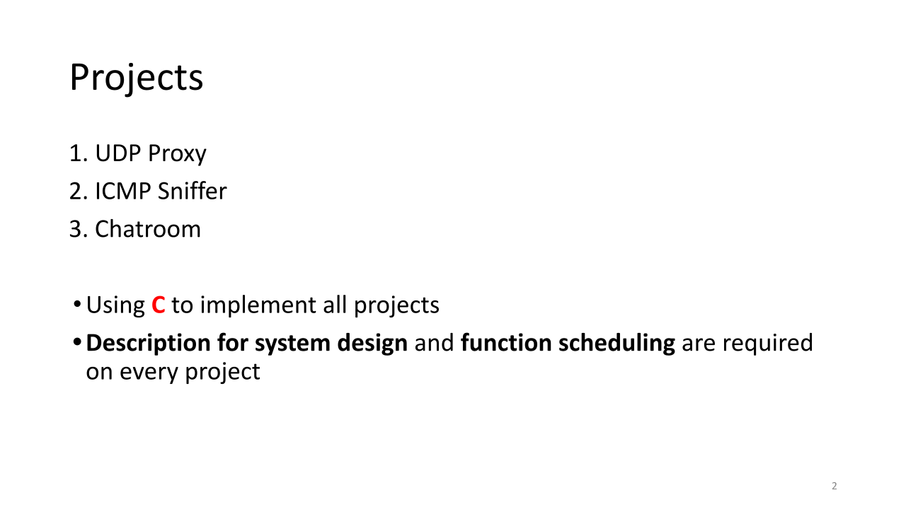
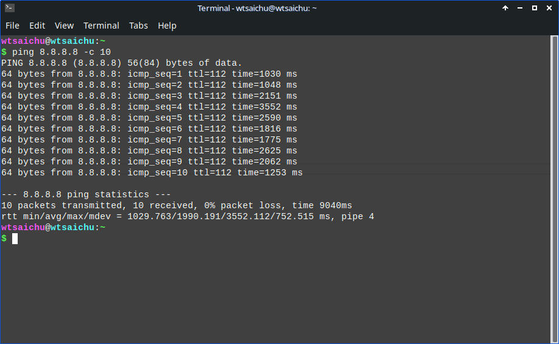

# ICMP Sniffer

Tags: C, orientation
Datum: 14. September 2023
Präsentation: https://docs.google.com/presentation/d/1oMAhEYahDZWlEfJ7PncI7stEhKSGDg8sTMcIRlJmKSY/edit#slide=id.g27f884e67dd_0_13
Status: Es kann geändert werden

# Rule



- Using C to implement all projects
- **Description for system design** and **function scheduling** are required on every project

# Zum Beispiele


# Anforderung

## IPv4

1. IPv4 IP_hdr : IPv4 packet header length
2. package size
3. type of protocol
4. ttl

## ICMP

1. type : Erklären Sie, was Typ bedeutet
2. checksum
3. id
4. sequence

## ICMP Definition

### Type

```c
#define ICMP_ECHOREPLY		0	/* Echo Reply,回显应答（ECHO-REPLY） 			*/
#define ICMP_DEST_UNREACH	3	/* Destination Unreachable,不可到达	*/
#define ICMP_SOURCE_QUENCH	4	/* Source Quench,源站抑制		*/
#define ICMP_REDIRECT		5	/* Redirect (change route),重定向	*/
#define ICMP_ECHO		8	/* Echo Request,回显请求（ECHO-REQUEST）			*/
#define ICMP_TIME_EXCEEDED	11	/* Time Exceeded,数据报超时		*/
#define ICMP_PARAMETERPROB	12	/* Parameter Problem,参数失灵		*/
#define ICMP_TIMESTAMP		13	/* Timestamp Request,时间戳请求		*/
#define ICMP_TIMESTAMPREPLY	14	/* Timestamp Reply,时间戳应答		*/
#define ICMP_INFO_REQUEST	15	/* Information Request,信息请求（已不再使用）		*/
#define ICMP_INFO_REPLY		16	/* Information Reply,信息应答（已不再使用）		*/
#define ICMP_ADDRESS		17	/* Address Mask Request,地址掩码请求（已不再使用）		*/
#define ICMP_ADDRESSREPLY	18	/* Address Mask Reply,地址掩码应答（已不再使用）		*/
#define NR_ICMP_TYPES		18
```

### Code

```c
/* Codes for UNREACH. */
#define ICMP_NET_UNREACH	0	/* Network Unreachable		*/
#define ICMP_HOST_UNREACH	1	/* Host Unreachable		*/
#define ICMP_PROT_UNREACH	2	/* Protocol Unreachable		*/
#define ICMP_PORT_UNREACH	3	/* Port Unreachable		*/
#define ICMP_FRAG_NEEDED	4	/* Fragmentation Needed/DF set	*/
#define ICMP_SR_FAILED		5	/* Source Route failed		*/
#define ICMP_NET_UNKNOWN	6
#define ICMP_HOST_UNKNOWN	7
#define ICMP_HOST_ISOLATED	8
#define ICMP_NET_ANO		9
#define ICMP_HOST_ANO		10
#define ICMP_NET_UNR_TOS	11
#define ICMP_HOST_UNR_TOS	12
#define ICMP_PKT_FILTERED	13	/* Packet filtered */
#define ICMP_PREC_VIOLATION	14	/* Precedence violation */
#define ICMP_PREC_CUTOFF	15	/* Precedence cut off */
#define NR_ICMP_UNREACH		15	/* instead of hardcoding immediate value */
```

# Ping



# Execution

## Command

**Terminal Eins**

```c
gcc ./ICMP.c -o ./ICMP
sudo ./ICMP
```


**Terminal Zwei**

```c
ping 192.168.
ping 8.8.8.8
```

## Find (un)available IP


Wie Sie sehen, wird der Prozess mit dem Typ = 3 ausgelöst

## Ping avaliable IP

```c
ping 8.8.8.8
```


[https://sites.uclouvain.be/SystInfo/usr/include/netinet/ip_icmp.h.html](https://sites.uclouvain.be/SystInfo/usr/include/netinet/ip_icmp.h.html)

# Execution 2

```c
gcc ICMP.c -o ./ICMP
sudo ./ICMP
```


## Unavaliable IP and avaliable IP

```c
ping 192.168.1.1 -c 5
ping 8.8.8.8 -c 5
```

