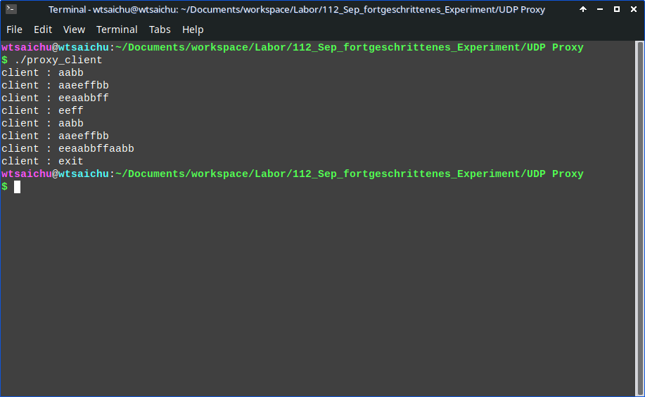

# UDP Proxy

Tags: C, orientation
Datum: 18. September 2023
Status: Im Gange

Use UDP socket to design a UDP Proxy

# Rule

.png)

- Payload with ‘aabb’ turn into ‘ccdd’
- Payload with ‘eeff’ -> drop
- Else forward normally

# Zum Beispiele

.png)

# Einführung

## Proxy

A proxy, in the context of computer networking, is an intermediary server or software system that acts as a gateway between a client (such as a user's computer or a client application) and another server or service (such as a web server or an online resource). Proxies are used for various purposes, including improving security, enhancing performance, and providing anonymity. Here are some key aspects of proxies:

1. **Intermediary Server**: A proxy server sits between the client and the destination server. When a client requests a resource or service, the request is first sent to the proxy server. The proxy then forwards the request to the destination server on behalf of the client.
2. **Request Forwarding**: Proxies forward client requests to the appropriate destination, whether it's a web server, file server, or another service. This allows the client to access resources indirectly through the proxy.
3. **Response Forwarding**: Proxies also receive responses from the destination server and forward them back to the client. This means that the client interacts with the proxy as if it were the actual server.
4. **Caching**: Some proxies, known as caching proxies, store copies of previously accessed resources locally. When a client requests a cached resource, the proxy can serve it directly without forwarding the request to the destination server. This can significantly improve response times and reduce server load.
5. **Anonymity**: Certain types of proxies, called anonymous proxies, are used to hide the client's IP address from the destination server. This can help protect the client's identity and privacy when accessing online resources.
6. **Security**: Proxies can act as a security barrier between the client and the internet. They can filter incoming and outgoing traffic, blocking malicious content, viruses, and unauthorized access attempts. These are often referred to as security proxies or firewall proxies.
7. **Load Balancing**: Proxies can distribute client requests across multiple destination servers to balance the load and ensure efficient resource utilization. This is commonly used in large-scale web applications to improve performance and redundancy.
8. **Content Filtering**: Proxies can be configured to block or filter specific types of content or websites. This is often implemented in corporate networks to enforce internet usage policies.
9. **Reverse Proxy**: A reverse proxy sits in front of web servers and handles client requests on their behalf. It can perform tasks like load balancing, SSL termination, and caching. Reverse proxies are commonly used to improve the performance and security of web applications.
10. **Transparent vs. Explicit Proxies**: Proxies can be configured in different ways. Some proxies are transparent, meaning that they intercept and forward traffic without the client's knowledge. Others are explicit, requiring client configuration to use the proxy.

Proxies are a fundamental component of network architecture and are used in various scenarios to achieve different goals, such as optimizing network performance, enhancing security, and maintaining anonymity. The choice of proxy type and its configuration depends on the specific requirements of the network or application.

## bind ()

### Bind 函數

將socket與本機上的一個埠相關聯，隨你就可以在該埠監聽服務請求。Bind函數原型為：

```jsx
int bind(int sockfd,struct sockaddr *my_addr, int addrlen);
```

### Parameter

| Name | Typ | Einführung |
| --- | --- | --- |
| Sockfd | integer | 調用 socket 函數返回的 socket 描述符 |
| my_addr | struct sockaddr * | 指向包含有本機 IP 位址及埠號等資訊的 sockaddr 類型的指針 |
| addrlen | integer | 常被設置為sizeof(struct sockaddr) |

# Ausführung

## Client

```c
gcc ./proxy_client.c -o proxy_client
./proxy_client
```



## Server

```c
gcc ./proxy_server.c -o proxy_server
./proxy_server
```

